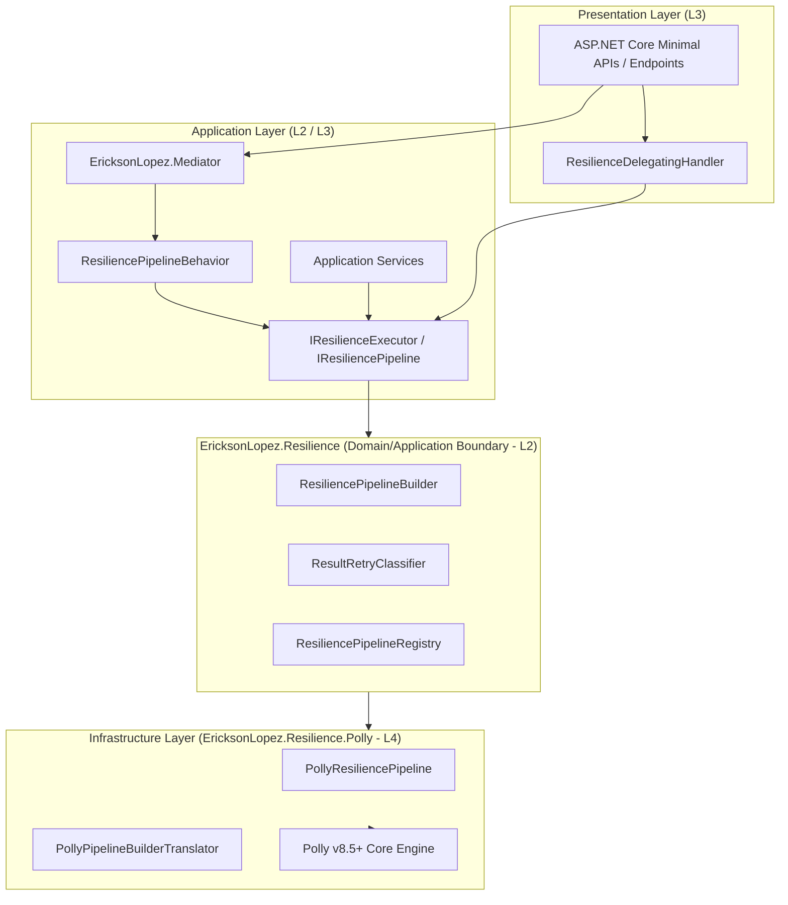
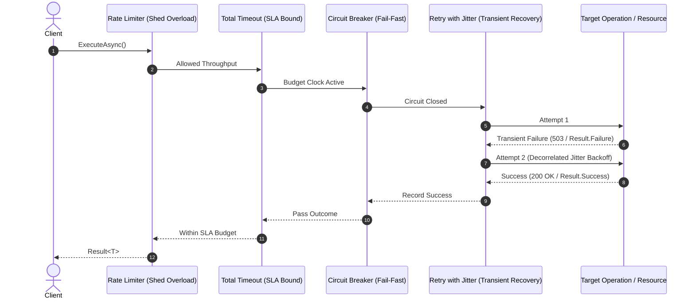

# EricksonLopez.Resilience

High-performance, Clean Architecture resilience framework, fault-tolerance ecosystem, and telemetry pipeline for modern .NET.

[](https://github.com/ericksonlopezf/dotnet-resilience/actions)
[](https://codecov.io/gh/ericksonlopezf/dotnet-resilience)
[](https://sonarcloud.io/summary/new_code?id=ericksonlopezf_dotnet-resilience)
[](https://github.com/ericksonlopezf/dotnet-resilience/blob/main/docs/ci-cd-quality.md)
[](https://www.nuget.org/packages/EricksonLopez.Resilience)
[](https://www.nuget.org/packages/EricksonLopez.Resilience)
[](https://github.com/ericksonlopezf/dotnet-resilience/blob/main/LICENSE)
[](https://dotnet.microsoft.com)
[](https://learn.microsoft.com/en-us/dotnet/core/deploying/native-aot)

**EricksonLopez.Resilience** is an enterprise-grade architectural resilience and fault-tolerance framework engineered for .NET 8, .NET 9, and .NET 10. Built strictly upon Clean Architecture and Domain-Driven Design (DDD) principles, it decouples application and domain layers from third-party infrastructure engines (Polly v8+), provides deep native integration with `EricksonLopez.Result`, enforces transactional and concurrency safety across retry cycles, and guarantees 100% Native AOT trimming compliance with zero-allocation telemetry.

---

## Table of Contents

- [What Problem It Solves](#-what-problem-it-solves)
  - [The Hidden Costs & Anti-Patterns of Traditional Resilience](#the-hidden-costs--anti-patterns-of-traditional-resilience)
  - [How EricksonLopez.Resilience Solves This](#how-ericksonlopezresilience-solves-this)
- [Key Features](#-key-features)
- [Ecosystem](#-ecosystem)
- [Documentation](#-documentation)
  - [Interactive Showcase (Levels 00 to 10)](#-step-by-step-interactive-showcase-levels-00-to-10)
  - [Technical Reference & Architecture Guides](#-technical-reference--architecture-guides)
- [Installation](#-installation)
- [Quick Start](#-quick-start)
  - [1. Service Registration & Policy Definition](#1-service-registration--policy-definition)
  - [2. Executing Operations in Application Services](#2-executing-operations-in-application-services)
  - [3. Reusable Strongly-Typed Policy Classes](#3-reusable-strongly-typed-policy-classes)
  - [4. Contextual Metadata & Telemetry Propagation](#4-contextual-metadata--telemetry-propagation)
- [Core Use Cases](#-core-use-cases)
  - [Use Case 1: Clean Architecture CQRS Handlers with Mediator](#use-case-1-clean-architecture-cqrs-handlers-with-mediator)
  - [Use Case 2: Multi-Step Domain Operations with Result-Aware Short-Circuiting](#use-case-2-multi-step-domain-operations-with-result-aware-short-circuiting)
  - [Use Case 3: Resilient Database Transactions with Idempotency & Fresh State](#use-case-3-resilient-database-transactions-with-idempotency--fresh-state)
  - [Use Case 4: Resilient Outbound HTTP Client with Distributed Tracing](#use-case-4-resilient-outbound-http-client-with-distributed-tracing)
  - [Use Case 5: Speculative Parallel Hedging for High-SLA Read Queries](#use-case-5-speculative-parallel-hedging-for-high-sla-read-queries)
  - [Use Case 6: Dynamic Policy Configuration from IConfiguration](#use-case-6-dynamic-policy-configuration-from-iconfiguration)
- [Configuration & Integrations](#-configuration--integrations)
  - [ASP.NET Core Minimal APIs & Endpoint Metadata](#aspnet-core-minimal-apis--endpoint-metadata)
  - [HttpClient Delegating Handlers](#httpclient-delegating-handlers)
  - [OpenTelemetry Metrics & Distributed Tracing](#opentelemetry-metrics--distributed-tracing)
  - [Mediator Pipeline Behavior](#mediator-pipeline-behavior)
  - [Source-Generated Configuration Binders](#source-generated-configuration-binders)
- [Testing & Quality](#-testing--quality)
  - [Zero-Overhead Unit Testing with PassthroughResiliencePipeline](#zero-overhead-unit-testing-with-passthroughresiliencepipeline)
  - [Mocking & Execution Verification](#mocking--execution-verification)
  - [Quality Gates & Mutation Testing](#quality-gates--mutation-testing)
- [Performance Benchmarks](#-performance-benchmarks)
- [Compatibility & Technical Matrix](#-compatibility--technical-matrix)
  - [Target Frameworks & Native AOT Support](#target-frameworks--native-aot-support)
  - [Resilience Strategy Execution Ordering](#resilience-strategy-execution-ordering)
- [Architecture & Design Principles](#️-architecture--design-principles)
  - [Clean Architecture Layer Segregation](#clean-architecture-layer-segregation)
  - [Resilience Strategy Execution Sequence](#resilience-strategy-execution-sequence)
  - [Circuit Breaker State Machine](#circuit-breaker-state-machine)
- [Best Practices & Anti-Patterns](#-best-practices--anti-patterns)
- [Troubleshooting & Common Pitfalls](#️-troubleshooting--common-pitfalls)
- [Part of the EricksonLopez Ecosystem](#-part-of-the-ericksonlopez-ecosystem)
- [Contributing](#-contributing)
- [License](#-license)

---

## 🎯 What Problem It Solves

### The Hidden Costs & Anti-Patterns of Traditional Resilience

1. **Architectural Coupling to Third-Party Libraries**: In conventional setups, Polly abstractions (`ResiliencePipeline`, `ResilienceContext`) leak directly into domain services, application handlers, and HTTP clients. This couples business rules to third-party APIs, makes unit testing difficult, and causes widespread breaking changes during major library upgrades.
2. **Exception-Only Retry Blindness**: Standard resilience engines only intercept thrown exceptions (`HttpRequestException`, `SqlException`). In modern Domain-Driven Design and Railway-Oriented Programming, errors are modeled as functional `Result<T>` returns. Traditional retries completely miss transient domain failures (e.g., `Result.Failure(Error.Unavailable)`), allowing transient infrastructure hiccups to fail unrecovered.
3. **Corrupted Transactions & Lost Idempotency on Retries**: Wrapping an entire transaction block inside a retry loop without resetting state causes retries on dirty, tracked entities in an invalid `DbContext`. Conversely, regenerating new idempotency keys per attempt creates duplicate downstream writes.
4. **Threadpool Starvation via Synchronous APIs**: Synchronous blocking APIs (`.Execute()`) in high-concurrency cloud microservices cause thread exhaustion, cascading latency spikes, and deadlocks.
5. **High Allocation Overhead & Reflection in Critical Paths**: Naive resilience wrappers create closures, box structs, and use reflection to bind configuration options, degrading GC performance and breaking Native AOT compilation.

### How EricksonLopez.Resilience Solves This

- **First-Party L0 Abstractions & Strict L4 Infrastructure Isolation**: Domain and application layers depend solely on lightweight, first-party interfaces (`IResilienceExecutor`, `IResiliencePipeline`, `ResilienceContext`). Polly v8+ is isolated as an interchangeable infrastructure adapter (`EricksonLopez.Resilience.Polly`).
- **Deep Result Pattern Integration (`ResultRetryClassifier`)**: Transparently inspects both exceptions and returned `Result<T>` values. Automatically classifies errors by `ErrorType` and `ErrorRetryability`, retrying transient infrastructure faults (`Unavailable`, `Infrastructure`) while short-circuiting permanent business rejections (`Validation`, `Conflict`, `Unauthorized`).
- **Transactional Boundary & Idempotency Safety**: Provides clear architectural patterns where each retry attempt initiates a fresh Unit of Work / database transaction while preserving the original distributed idempotency key and correlation context across attempts.
- **Pure Asynchronous ValueTask APIs**: Completely bans synchronous execution APIs (ADR-006), ensuring non-blocking execution across all pipelines and eliminating threadpool starvation risks.
- **100% Native AOT & Trimming Compliant**: Zero reflection on critical execution paths, context pooling via `ResilienceContextPool`, struct-based Mediator continuation delegates, and source-generated configuration binders.

---

## ⚡ Key Features

- 🏛️ **Clean Architecture Layering**: Strict isolation between Foundation (L0), Core Application (L2), Integrations (L3), and Infrastructure Adapters (L4).
- 🔄 **Native Result<T> Error Classification**: Automatic evaluation of `Result<T>` error retryability alongside CLR exceptions.
- 🚀 **100% Native AOT & Trimming Compliant**: Verified with `<TreatWarningsAsErrors>true</TreatWarningsAsErrors>` and automated AOT smoke testing.
- 📊 **W3C Semantic Observability**: Native OpenTelemetry meters (`resilience.execution.duration`, `resilience.retry.attempts`) and distributed tracing spans (`Resilience.Execute`).
- 🔒 **Transaction & Concurrency Safe**: Preserves idempotency keys across retries while reloading fresh aggregate state on optimistic concurrency conflicts.
- 🧩 **Zero-Allocation Mediator Integration**: Struct-continuation pipeline behavior for `EricksonLopez.Mediator` (`IResilientRequest`).
- ⚡ **Pure ValueTask Execution**: High-throughput async pipelines optimized for zero synchronous thread blocking.
- 🛡️ **Comprehensive Strategy Catalog**: Retry with decorrelated exponential jitter, Circuit Breaker, Timeout, Rate Limiting (Concurrency/Window/TokenBucket), Fallback, and Speculative Hedging.
- 🧪 **Enterprise Quality Gates**: 100% mutation test score (Stryker.NET), NetArchTest architecture rules enforcement, and automated compliance auditing.

---

## 📦 Ecosystem

The `EricksonLopez.Resilience` ecosystem is partitioned into modular, fine-grained packages targeting `net8.0`, `net9.0`, and `net10.0`:

| Package | Layer | Description | Target Frameworks | NuGet |
|---|---|---|---|:---:|
| [`EricksonLopez.Resilience.Abstractions`](https://www.nuget.org/packages/EricksonLopez.Resilience.Abstractions) | L0 Foundation | Core contracts (`IResilienceExecutor`, `IResiliencePipeline`, `ResilienceContext`, Strategy Options) | `net8.0;net9.0;net10.0` | [](https://www.nuget.org/packages/EricksonLopez.Resilience.Abstractions) |
| [`EricksonLopez.Resilience`](https://www.nuget.org/packages/EricksonLopez.Resilience) | L2 Core | Fluent strategy builders, `ResultRetryClassifier`, `ResiliencePolicy` base class, and registries | `net8.0;net9.0;net10.0` | [](https://www.nuget.org/packages/EricksonLopez.Resilience) |
| [`EricksonLopez.Resilience.Polly`](https://www.nuget.org/packages/EricksonLopez.Resilience.Polly) | L4 Infrastructure | Polly v8+ execution engine adapter, pipeline builders, and exception translators | `net8.0;net9.0;net10.0` | [](https://www.nuget.org/packages/EricksonLopez.Resilience.Polly) |
| [`EricksonLopez.Resilience.DependencyInjection`](https://www.nuget.org/packages/EricksonLopez.Resilience.DependencyInjection) | L3 Integration | Service registration extensions (`AddEricksonLopezResilience`) and configuration binders | `net8.0;net9.0;net10.0` | [](https://www.nuget.org/packages/EricksonLopez.Resilience.DependencyInjection) |
| [`EricksonLopez.Resilience.Mediator`](https://www.nuget.org/packages/EricksonLopez.Resilience.Mediator) | L3 Integration | Zero-allocation struct-continuation `ResiliencePipelineBehavior` for `EricksonLopez.Mediator` | `net8.0;net9.0;net10.0` | [](https://www.nuget.org/packages/EricksonLopez.Resilience.Mediator) |
| [`EricksonLopez.Resilience.OpenTelemetry`](https://www.nuget.org/packages/EricksonLopez.Resilience.OpenTelemetry) | L3 Observability | Metrics (`ResilienceMeter`) and distributed tracing instrumentation (`ResilienceActivitySource`) | `net8.0;net9.0;net10.0` | [](https://www.nuget.org/packages/EricksonLopez.Resilience.OpenTelemetry) |
| [`EricksonLopez.Resilience.AspNetCore`](https://www.nuget.org/packages/EricksonLopez.Resilience.AspNetCore) | L3 Presentation | Minimal API `RequireResilience` endpoint metadata and resilient `HttpClient` delegating handlers | `net8.0;net9.0;net10.0` | [](https://www.nuget.org/packages/EricksonLopez.Resilience.AspNetCore) |

---

## 📚 Documentation

> 🌐 **Official Documentation Hub:** [https://github.com/ericksonlopezf/dotnet-resilience/tree/main/docs](https://github.com/ericksonlopezf/dotnet-resilience/tree/main/docs)

### 🎓 Step-by-Step Interactive Showcase (Levels 00 to 10)

The repository provides an executable showcase (`samples/Showcase/`) covering progressive architectural levels:

| Level | Topic | Description |
|---|---|---|
| [**Level 00**](https://github.com/ericksonlopezf/dotnet-resilience/blob/main/docs/showcase/level-00-introduction.md) | **Architectural Introduction & Mental Model** | Core resilience concepts, Polly encapsulation, and mental models |
| [**Level 01**](https://github.com/ericksonlopezf/dotnet-resilience/blob/main/docs/showcase/level-01-retry-and-circuit-breakers.md) | **Retry & Circuit Breakers** | Basic pipeline configuration, exponential jitter backoff, and circuit breaker |
| [**Level 02**](https://github.com/ericksonlopezf/dotnet-resilience/blob/main/docs/showcase/level-02-rate-limiting-and-hedging.md) | **Rate Limiting & Hedging** | Concurrency control, sliding windows, and speculative parallel hedging |
| [**Level 03**](https://github.com/ericksonlopezf/dotnet-resilience/blob/main/docs/showcase/level-03-zero-allocation-aot.md) | **Zero-Allocation & Native AOT** | Memory optimization, pooling, and Native AOT compilation guarantees |
| [**Level 04**](https://github.com/ericksonlopezf/dotnet-resilience/blob/main/docs/showcase/level-04-mediator-transactions.md) | **Mediator & Transactions** | Pipeline behaviors, `IResilientRequest`, and transactional boundaries |
| [**Level 05**](https://github.com/ericksonlopezf/dotnet-resilience/blob/main/docs/showcase/level-05-processing-multitenancy.md) | **Multi-Tenancy Resilience** | Tenant-isolated execution contexts, rate limiting, and telemetry |
| [**Level 06**](https://github.com/ericksonlopezf/dotnet-resilience/blob/main/docs/showcase/level-06-error-classification.md) | **Error Classification & Result** | Evaluating `Result<T>`, `ErrorType`, and `ErrorRetryability` |
| [**Level 07**](https://github.com/ericksonlopezf/dotnet-resilience/blob/main/docs/showcase/level-07-scalability-benchmarks.md) | **Scalability & Performance** | High-throughput stress testing, lock-free registries, and overhead benchmarks |
| [**Level 08**](https://github.com/ericksonlopezf/dotnet-resilience/blob/main/docs/showcase/level-08-custom-policies-typed-pipelines.md) | **Strongly-Typed Policies** | Strongly-typed `ResiliencePolicy` classes and `IResiliencePipeline<TResult>` |
| [**Level 09**](https://github.com/ericksonlopezf/dotnet-resilience/blob/main/docs/showcase/level-09-http-aspnetcore-opentelemetry.md) | **ASP.NET Core & OpenTelemetry** | Minimal APIs, `HttpClient` delegating handlers, and distributed tracing |
| [**Level 10**](https://github.com/ericksonlopezf/dotnet-resilience/blob/main/docs/showcase/level-10-enterprise-architecture.md) | **Enterprise Architecture & Governance** | Clean Architecture enforcement, CI/CD gates, and mutation testing |

### 📖 Technical Reference & Architecture Guides

- [**Architecture & Design Principles**](https://github.com/ericksonlopezf/dotnet-resilience/blob/main/docs/architecture.md) — Layer segregation, execution pipelines, and invariants.
- [**API Reference Guide**](https://github.com/ericksonlopezf/dotnet-resilience/blob/main/docs/api-reference.md) — Microsoft Learn-style documentation for all public types.
- [**Architectural Decision Records (ADRs)**](https://github.com/ericksonlopezf/dotnet-resilience/tree/main/docs/decisions) — ADRs documenting design rationale (ADR-001 to ADR-019).
- [**Resilience Policies Guide**](https://github.com/ericksonlopezf/dotnet-resilience/blob/main/docs/policies.md) — Policy declaration, registries, and presets.
- [**Retry Strategy & Jitter**](https://github.com/ericksonlopezf/dotnet-resilience/blob/main/docs/retry.md) — Backoff algorithms, jitter decorators, and retry conditions.
- [**Circuit Breaker Strategy**](https://github.com/ericksonlopezf/dotnet-resilience/blob/main/docs/circuit-breaker.md) — State machine transitions, failure ratios, and break durations.
- [**Timeout Strategy**](https://github.com/ericksonlopezf/dotnet-resilience/blob/main/docs/timeout.md) — SLA deadlines and cooperative cancellation.
- [**Rate Limiting Strategy**](https://github.com/ericksonlopezf/dotnet-resilience/blob/main/docs/rate-limiting.md) — Concurrency, sliding window, token bucket, and fixed window limiters.
- [**Hedging Strategy**](https://github.com/ericksonlopezf/dotnet-resilience/blob/main/docs/hedging.md) — Speculative execution for high-percentile latency reduction.
- [**Result Pattern Integration**](https://github.com/ericksonlopezf/dotnet-resilience/blob/main/docs/result-integration.md) — `EricksonLopez.Result` classification and error handling.
- [**Mediator Pipeline Integration**](https://github.com/ericksonlopezf/dotnet-resilience/blob/main/docs/mediator-integration.md) — Struct-continuation pipeline behaviors for CQRS.
- [**Idempotency & Resilience Integration**](https://github.com/ericksonlopezf/dotnet-resilience/blob/main/docs/idempotency-integration.md) — Preserving idempotency keys across retries.
- [**Optimistic Concurrency & Resilience**](https://github.com/ericksonlopezf/dotnet-resilience/blob/main/docs/concurrency-integration.md) — Aggregate reloads and concurrency conflict resolution.
- [**Transaction Boundaries & Resilience**](https://github.com/ericksonlopezf/dotnet-resilience/blob/main/docs/transaction-integration.md) — Safe Unit of Work and transaction scoping.
- [**Outbox Pattern & Resilience**](https://github.com/ericksonlopezf/dotnet-resilience/blob/main/docs/outbox-integration.md) — Reliable event publishing and retries.
- [**Observability & OpenTelemetry**](https://github.com/ericksonlopezf/dotnet-resilience/blob/main/docs/observability.md) — Metrics, counters, and distributed tracing instrumentation.
- [**Dependency Injection & Configuration**](https://github.com/ericksonlopezf/dotnet-resilience/blob/main/docs/dependency-injection.md) — Service registration and `IConfiguration` binders.
- [**ASP.NET Core Endpoint Resilience**](https://github.com/ericksonlopezf/dotnet-resilience/blob/main/docs/aspnet-core.md) — Minimal API metadata and endpoint filters.
- [**Resilient HttpClient Integration**](https://github.com/ericksonlopezf/dotnet-resilience/blob/main/docs/http-client.md) — Delegating handlers and HTTP policies.
- [**Testing Strategies & Verification**](https://github.com/ericksonlopezf/dotnet-resilience/blob/main/docs/testing.md) — Unit testing with `PassthroughResiliencePipeline`.
- [**Performance & Allocation Benchmarks**](https://github.com/ericksonlopezf/dotnet-resilience/blob/main/docs/performance.md) — Allocation profiles and BenchmarkDotNet setup.
- [**Native AOT & Trimming Compatibility**](https://github.com/ericksonlopezf/dotnet-resilience/blob/main/docs/aot.md) — Trim-safety guarantees and smoke test architecture.
- [**CI/CD, Quality Gates & Build Engineering**](https://github.com/ericksonlopezf/dotnet-resilience/blob/main/docs/ci-cd-quality.md) — Quality gates, CPM, and GitHub Actions workflows.
- [**Migration Guide from Legacy Polly**](https://github.com/ericksonlopezf/dotnet-resilience/blob/main/docs/migration.md) — Step-by-step migration path from Polly v7/v8.
- [**Cookbook: Production Recipes Collection**](https://github.com/ericksonlopezf/dotnet-resilience/blob/main/docs/cookbook.md) — 10 ready-to-use production recipes.
- [**FAQ & Troubleshooting**](https://github.com/ericksonlopezf/dotnet-resilience/blob/main/docs/faq-troubleshooting.md) — Common pitfalls and diagnostic resolutions.
- [**Packages & Compatibility Matrix**](https://github.com/ericksonlopezf/dotnet-resilience/blob/main/docs/packages.md) — Central package management and TFM versions.

---

## 📥 Installation

### 1. Core Framework & Dependency Injection (Recommended)

```bash
dotnet add package EricksonLopez.Resilience.DependencyInjection
```

> Transitive dependencies include `EricksonLopez.Resilience.Abstractions`, `EricksonLopez.Resilience`, and `EricksonLopez.Resilience.Polly`.

### 2. Optional Integration & Presentation Packages

```bash
# ASP.NET Core endpoint resilience & resilient HttpClient delegating handlers
dotnet add package EricksonLopez.Resilience.AspNetCore

# Zero-allocation struct pipeline behavior for EricksonLopez.Mediator
dotnet add package EricksonLopez.Resilience.Mediator

# OpenTelemetry metrics and distributed tracing instrumentation
dotnet add package EricksonLopez.Resilience.OpenTelemetry
```

### 3. Foundation Package (Domain & Application Layers)

```bash
# Lightweight abstractions only (zero third-party dependencies)
dotnet add package EricksonLopez.Resilience.Abstractions
```

---

## 🚀 Quick Start

### 1. Service Registration & Policy Definition

Configure named resilience policies during application startup using fluent strategy builders:

```csharp
using System;
using EricksonLopez.Resilience.DependencyInjection;
using EricksonLopez.Resilience.Extensions;
using EricksonLopez.Resilience.Options;
using Microsoft.Extensions.DependencyInjection;

var services = new ServiceCollection();

// Register resilience framework and configure named policies
services.AddEricksonLopezResilience(options =>
{
    // Configure standard payment processing policy
    options.AddPolicy("payment-gateway-policy", builder =>
    {
        builder
            .AddTimeout(TimeSpan.FromSeconds(5))
            .AddResultRetry(opt =>
            {
                opt.MaxRetryAttempts = 3;
                opt.Delay = TimeSpan.FromMilliseconds(150);
                opt.BackoffType = BackoffType.ExponentialWithJitter;
            })
            .AddCircuitBreaker(opt =>
            {
                opt.FailureRatio = 0.5;
                opt.MinimumThroughput = 10;
                opt.SamplingDuration = TimeSpan.FromSeconds(30);
                opt.BreakDuration = TimeSpan.FromSeconds(15);
            });
    });
});
```

### 2. Executing Operations in Application Services

Inject `IResilienceExecutor` into application services and execute operations returning `Result<T>`:

```csharp
using System.Threading;
using System.Threading.Tasks;
using EricksonLopez.Resilience;
using EricksonLopez.Result;

public sealed class PaymentApplicationService(
    IResilienceExecutor executor,
    IPaymentGatewayClient gatewayClient)
{
    public ValueTask<Result<PaymentReceipt>> ProcessPaymentAsync(
        PaymentCommand command,
        CancellationToken cancellationToken = default)
    {
        return executor.ExecuteAsync(
            "payment-gateway-policy",
            async ct => await gatewayClient.AuthorizeAndCaptureAsync(command, ct),
            cancellationToken);
    }
}
```

### 3. Reusable Strongly-Typed Policy Classes

Encapsulate resilience configurations into dedicated, testable domain policy classes:

```csharp
using System;
using EricksonLopez.Resilience;
using EricksonLopez.Resilience.DependencyInjection;
using EricksonLopez.Resilience.Extensions;
using EricksonLopez.Resilience.Options;
using Microsoft.Extensions.DependencyInjection;

public sealed class DatabaseResiliencePolicy : ResiliencePolicy
{
    public override string Name => "database-policy";

    public override void Configure(IResiliencePipelineBuilder builder)
    {
        builder
            .AddTimeout(TimeSpan.FromSeconds(10))
            .AddRetry(opt =>
            {
                opt.MaxRetryAttempts = 3;
                opt.Delay = TimeSpan.FromMilliseconds(100);
                opt.BackoffType = BackoffType.ExponentialWithJitter;
            });
    }
}

// Registration in Dependency Injection
services.AddResiliencePolicy<DatabaseResiliencePolicy>();
```

### 4. Contextual Metadata & Telemetry Propagation

Propagate distributed tracing context, tenant IDs, and correlation IDs across retry loops:

```csharp
using System.Threading;
using System.Threading.Tasks;
using EricksonLopez.Resilience;
using EricksonLopez.Result;

public sealed class OrderProcessingService(IResilienceExecutor executor, IOrderRepository repository)
{
    public ValueTask<Result<Order>> LoadOrderAsync(
        string orderId,
        string tenantId,
        string correlationId,
        CancellationToken cancellationToken = default)
    {
        var context = ResilienceContext.Create("database-policy", cancellationToken)
            .WithOperationName("LoadOrderAggregate")
            .WithTenantId(tenantId)
            .WithCorrelationId(correlationId);

        return executor.ExecuteAsync(
            "database-policy",
            async ctx =>
            {
                // ctx carries AttemptNumber, TenantId, CorrelationId into internal logs & traces
                return await repository.FindByIdAsync(orderId, ctx.CancellationToken);
            },
            context,
            cancellationToken);
    }
}
```

---

## 💡 Core Use Cases

### Use Case 1: Clean Architecture CQRS Handlers with Mediator

Attach resilience policies declaratively to CQRS commands/queries using `IResilientRequest` without polluting business logic:

```csharp
using System.Threading;
using System.Threading.Tasks;
using EricksonLopez.Mediator;
using EricksonLopez.Resilience.Mediator.Contracts;
using EricksonLopez.Result;

// 1. Declare Resilient Command
public sealed record ProcessOrderCommand(string OrderId, decimal Amount)
    : IRequest<Result<OrderConfirmation>>, IResilientRequest
{
    public string ResiliencePolicy => "order-processing-policy";
}

// 2. Pure Business Handler (No Polly or Resilience dependencies)
public sealed class ProcessOrderCommandHandler(IOrderProcessor processor)
    : IRequestHandler<ProcessOrderCommand, Result<OrderConfirmation>>
{
    public async ValueTask<Result<OrderConfirmation>> Handle(
        ProcessOrderCommand request,
        CancellationToken cancellationToken)
    {
        return await processor.ExecuteAsync(request.OrderId, request.Amount, cancellationToken);
    }
}

// 3. Register Pipeline Behavior in Startup
services.AddResiliencePipelineBehavior();
```

### Use Case 2: Multi-Step Domain Operations with Result-Aware Short-Circuiting

Execute multi-step business pipelines where permanent validation errors short-circuit immediately, while transient infrastructure failures trigger retries:

```csharp
using System;
using System.Threading;
using System.Threading.Tasks;
using EricksonLopez.Resilience;
using EricksonLopez.Result;

public sealed class CustomerRegistrationService(
    IResilienceExecutor executor,
    ICustomerVerificationClient verificationClient,
    ICustomerRepository repository)
{
    public async ValueTask<Result<CustomerId>> RegisterCustomerAsync(
        RegisterCustomerDto dto,
        CancellationToken cancellationToken)
    {
        return await executor.ExecuteAsync(
            "customer-registration-policy",
            async ctx =>
            {
                // Permanent business validation (ErrorType.Validation) -> Immediately short-circuits (No Retry)
                if (string.IsNullOrWhiteSpace(dto.TaxId))
                {
                    return Result<CustomerId>.Failure(Error.Validation("TaxId.Empty", "Tax ID is required."));
                }

                // Remote verification (Transient ErrorType.Unavailable) -> Triggers retry with jitter
                var verificationResult = await verificationClient.VerifyTaxIdAsync(dto.TaxId, ctx.CancellationToken);
                if (verificationResult.IsFailure)
                {
                    return Result<CustomerId>.Failure(verificationResult.Error);
                }

                var customer = Customer.Create(dto.Name, dto.TaxId);
                await repository.SaveAsync(customer, ctx.CancellationToken);

                return Result<CustomerId>.Success(customer.Id);
            },
            cancellationToken);
    }
}
```

### Use Case 3: Resilient Database Transactions with Idempotency & Fresh State

Preserve distributed idempotency keys while opening a fresh Unit of Work / database transaction on each attempt:

```csharp
using System.Threading;
using System.Threading.Tasks;
using EricksonLopez.Resilience;
using EricksonLopez.Result;

public sealed class ResilientOrderDispatcher(
    IResilienceExecutor executor,
    IUnitOfWorkFactory uowFactory)
{
    public async ValueTask<Result<Unit>> DispatchOrderAsync(
        string orderId,
        string idempotencyKey,
        CancellationToken cancellationToken)
    {
        var context = ResilienceContext.Create("database-policy", cancellationToken)
            .WithCorrelationId(idempotencyKey);

        return await executor.ExecuteAsync(
            "database-policy",
            async ctx =>
            {
                // Always create a fresh Unit of Work per attempt to prevent dirty state tracking
                await using var uow = await uowFactory.CreateAsync(ctx.CancellationToken);

                // Reload aggregate state to avoid optimistic concurrency conflicts
                var order = await uow.Orders.GetByIdAsync(orderId, ctx.CancellationToken);
                if (order is null)
                {
                    return Result<Unit>.Failure(Error.NotFound("Order.NotFound", "Order does not exist."));
                }

                var dispatchResult = order.Dispatch();
                if (dispatchResult.IsFailure)
                {
                    return dispatchResult;
                }

                await uow.CommitAsync(ctx.CancellationToken);
                return Result<Unit>.Success(Unit.Value);
            },
            context,
            cancellationToken);
    }
}
```

### Use Case 4: Resilient Outbound HTTP Client with Distributed Tracing

Configure external third-party API integration with automatic timeout, circuit breaking, retry, and OpenTelemetry instrumentation:

```csharp
using System;
using EricksonLopez.Resilience.AspNetCore.Extensions;
using EricksonLopez.Resilience.Extensions;
using EricksonLopez.Resilience.Options;
using Microsoft.Extensions.DependencyInjection;

services.AddEricksonLopezResilience(options =>
{
    options.AddPolicy("shipping-carrier-policy", builder =>
    {
        builder
            .AddTimeout(TimeSpan.FromSeconds(3))
            .AddRetry(opt =>
            {
                opt.MaxRetryAttempts = 3;
                opt.Delay = TimeSpan.FromMilliseconds(200);
                opt.BackoffType = BackoffType.ExponentialWithJitter;
            })
            .AddCircuitBreaker(opt =>
            {
                opt.FailureRatio = 0.5;
                opt.MinimumThroughput = 8;
                opt.SamplingDuration = TimeSpan.FromSeconds(20);
                opt.BreakDuration = TimeSpan.FromSeconds(30);
            });
    });
});

// Attach named resilience delegating handler to typed HttpClient
services.AddHttpClient<IShippingCarrierClient, ShippingCarrierClient>(client =>
{
    client.BaseAddress = new Uri("https://api.carrier.example.com/");
})
.AddResiliencePolicy("shipping-carrier-policy");
```

### Use Case 5: Speculative Parallel Hedging for High-SLA Read Queries

Execute parallel speculative requests against geo-distributed read replicas to eliminate P99 tail latency spikes:

```csharp
using System;
using System.Threading;
using System.Threading.Tasks;
using EricksonLopez.Resilience.Builder;
using EricksonLopez.Resilience.Options;
using EricksonLopez.Result;

public sealed class GeoDistributedPricingQueryService(IPriceReplicaClient replicaClient)
{
    private readonly ResiliencePipelineBuilder<Result<PriceQuote>> _builder;

    public GeoDistributedPricingQueryService()
    {
        _builder = new ResiliencePipelineBuilder<Result<PriceQuote>>("pricing-hedging-policy");
        _builder
            .AddTimeout(TimeSpan.FromSeconds(2))
            .AddHedging(new HedgingStrategyOptions<Result<PriceQuote>>
            {
                MaxHedgedAttempts = 2,
                Delay = TimeSpan.FromMilliseconds(50), // Hedged attempt spawns if primary takes > 50ms
                ShouldHandleResult = result => result.IsFailure
            });
    }

    public async ValueTask<Result<PriceQuote>> GetLivePriceQuoteAsync(
        string symbol,
        CancellationToken cancellationToken)
    {
        var pipeline = _builder.Build();
        return await pipeline.ExecuteAsync(
            async ct => await replicaClient.FetchPriceAsync(symbol, ct),
            cancellationToken);
    }
}
```

### Use Case 6: Dynamic Policy Configuration from IConfiguration

Allow DevOps and Site Reliability Engineering teams to tune retry counts, timeouts, and circuit breakers via `appsettings.json` without redeployment:

```json
{
  "Resilience": {
    "Policies": {
      "inventory-policy": {
        "Timeout": {
          "Timeout": "00:00:04"
        },
        "Retry": {
          "MaxRetryAttempts": 4,
          "Delay": "00:00:00.100",
          "BackoffType": "ExponentialWithJitter"
        },
        "CircuitBreaker": {
          "FailureRatio": 0.4,
          "MinimumThroughput": 10,
          "SamplingDuration": "00:00:30",
          "BreakDuration": "00:00:15"
        }
      }
    }
  }
}
```

```csharp
using EricksonLopez.Resilience.DependencyInjection;
using Microsoft.Extensions.Configuration;
using Microsoft.Extensions.DependencyInjection;

// Bind and register policy directly from configuration section
var policySection = configuration.GetSection("Resilience:Policies:inventory-policy");
services.AddResiliencePolicyFromConfiguration("inventory-policy", policySection);
```

---

## 🔌 Configuration & Integrations

### ASP.NET Core Minimal APIs & Endpoint Metadata

Attach resilience requirements directly to ASP.NET Core Minimal API endpoints:

```csharp
using EricksonLopez.Resilience.AspNetCore.Extensions;
using Microsoft.AspNetCore.Builder;
using Microsoft.AspNetCore.Http;

var builder = WebApplication.CreateBuilder(args);
var app = builder.Build();

app.MapGet("/api/products/{id}", async (string id, IProductCatalog catalog) =>
{
    var product = await catalog.GetByIdAsync(id);
    return product is not null ? Results.Ok(product) : Results.NotFound();
})
.RequireResilience("product-catalog-policy");
```

### HttpClient Delegating Handlers

Attach full-fledged resilience pipelines to `IHttpClientFactory` typed clients using out-of-the-box standard presets or custom policies:

```csharp
using EricksonLopez.Resilience.AspNetCore.Extensions;
using Microsoft.Extensions.DependencyInjection;

// Standard preset: Timeout (30s) + Exponential Jitter Retry (3 attempts) + Circuit Breaker
services.AddHttpClient("ExternalService")
    .AddStandardResilienceHandler();

// Custom named policy binding
services.AddHttpClient("LegacyPaymentGateway")
    .AddResiliencePolicy("payment-gateway-policy");
```

### OpenTelemetry Metrics & Distributed Tracing

Enable standardized OpenTelemetry instrumentation with zero reflection:

```csharp
using EricksonLopez.Resilience.OpenTelemetry.Extensions;
using Microsoft.Extensions.DependencyInjection;
using OpenTelemetry.Metrics;
using OpenTelemetry.Trace;

services.AddResilienceOpenTelemetry();

services.AddOpenTelemetry()
    .WithMetrics(metrics =>
    {
        metrics.AddMeter("EricksonLopez.Resilience");
    })
    .WithTracing(tracing =>
    {
        tracing.AddSource("EricksonLopez.Resilience");
    });
```

#### Emitted Metrics & Activity Tags

| Metric / Tag Name | Type | Description |
|---|---|---|
| `resilience.execution.duration` | Histogram (ms) | Total execution duration per pipeline execution |
| `resilience.retry.attempts` | Counter | Total retry attempts executed |
| `resilience.circuit_breaker.state_changes` | Counter | Circuit breaker transitions (`Closed`, `Open`, `HalfOpen`) |
| `resilience.timeout.rejections` | Counter | Total operations aborted due to timeout expiration |
| `resilience.rate_limiter.rejections` | Counter | Total requests rejected by rate limiting policies |
| Span Tag: `resilience.policy` | String | Logical name of the resilience policy |
| Span Tag: `resilience.operation` | String | Contextual operation name |
| Span Tag: `resilience.tenant` | String | Multi-tenant identifier |
| Span Tag: `resilience.correlation` | String | Distributed correlation identifier |

### Mediator Pipeline Behavior

Integrate resilience into `EricksonLopez.Mediator` with zero-allocation struct continuations:

```csharp
using EricksonLopez.Mediator.Extensions;
using EricksonLopez.Resilience.Mediator.Extensions;
using Microsoft.Extensions.DependencyInjection;

services.AddMediator(options =>
{
    // Auto-discover handlers
    options.RegisterServicesFromAssemblyContaining<Program>();
});

// Register resilience struct pipeline behavior
services.AddResiliencePipelineBehavior();
```

### Source-Generated Configuration Binders

Bind strategy options without runtime reflection to preserve 100% Native AOT compatibility:

```csharp
using EricksonLopez.Resilience.Configuration;
using EricksonLopez.Resilience.Options;
using Microsoft.Extensions.Configuration;

var retryOptions = new RetryStrategyOptions();
ResilienceConfigurationExtensions.BindRetryOptions(retryOptions, configuration.GetSection("Retry"));

var timeoutOptions = new TimeoutStrategyOptions();
ResilienceConfigurationExtensions.BindTimeoutOptions(timeoutOptions, configuration.GetSection("Timeout"));
```

---

## 🧪 Testing & Quality

### Zero-Overhead Unit Testing with PassthroughResiliencePipeline

In unit test suites, bypass resilience strategy evaluation completely using `PassthroughResiliencePipeline.Instance`:

```csharp
using System.Threading.Tasks;
using EricksonLopez.Resilience;
using EricksonLopez.Result;
using Xunit;
using AwesomeAssertions;

public sealed class OrderServiceTests
{
    [Fact]
    public async Task ProcessOrder_ShouldSucceed_WhenPassthroughPipelineIsUsed()
    {
        // Arrange
        IResiliencePipeline pipeline = PassthroughResiliencePipeline.Instance;

        // Act
        var result = await pipeline.ExecuteAsync(async ct =>
        {
            await Task.Yield();
            return Result<int>.Success(100);
        });

        // Assert
        result.IsSuccess.Should().BeTrue();
        result.Value.Should().Be(100);
    }
}
```

### Mocking & Execution Verification

Verify execution calls and contextual arguments using standard mocking frameworks:

```csharp
using System;
using System.Threading;
using System.Threading.Tasks;
using EricksonLopez.Resilience;
using EricksonLopez.Result;
using NSubstitute;
using Xunit;

public sealed class PaymentServiceMockTests
{
    [Fact]
    public async Task ProcessPayment_DispatchesToExpectedPolicy()
    {
        // Arrange
        var executor = Substitute.For<IResilienceExecutor>();
        var service = new PaymentService(executor);

        executor.ExecuteAsync(
            "payment-policy",
            Arg.Any<Func<CancellationToken, ValueTask<Result<string>>>>(),
            Arg.Any<CancellationToken>())
            .Returns(ValueTask.FromResult(Result<string>.Success("REC-12345")));

        // Act
        var result = await service.ExecutePaymentAsync(CancellationToken.None);

        // Assert
        await executor.Received(1).ExecuteAsync(
            "payment-policy",
            Arg.Any<Func<CancellationToken, ValueTask<Result<string>>>>(),
            Arg.Any<CancellationToken>());
    }
}
```

### Quality Gates & Mutation Testing

The repository enforces industry-leading software engineering quality standards:

1. **Zero Warnings Policy**: Compiled with `<TreatWarningsAsErrors>true</TreatWarningsAsErrors>` and `<WarningLevel>5</WarningLevel>` across .NET 8, .NET 9, and .NET 10.
2. **Mutation Testing Quality Gate (Stryker.NET)**:
   - **Fast CI**: Pushes and Pull Requests execute fast unit tests, Cobertura coverage, and Native AOT smoke testing.
   - **Quality Gate Execution**: Matrix Stryker mutation testing (`thresholds: { break: 95, high: 100, low: 98 }`) is executed as a Quality Gate on Pull Requests, scheduled weekly runs, and manual dispatch (`quality-gate/mutation-testing`).
   - **Release Gate Validation**: Before publishing to NuGet, the release workflow validates that the target commit achieved a mutation score ≥ 95%.
3. **Architectural Compliance**: Enforced via `NetArchTest.Rules` and `scripts/verify-compliance.ps1` (0 violations).
4. **Native AOT Smoke Testing**: 22 automated assertions executed against compiled self-contained Linux-x64 binaries in CI.

---

## ⚡ Performance Benchmarks

> **Environment:** .NET 10.0.10 (X64 RyuJIT AVX-512), BenchmarkDotNet v0.15.8, Windows 11 Enterprise.

### Primary Operations Benchmark

| Method | Mean | Ratio | Allocated | Overhead vs Direct Polly |
|---|---:|---:|---:|---|
| `DirectPollyExecution` *(Raw Polly v8 Baseline)* | 18.24 ns | 1.00 | **0 B** | Baseline |
| `EcosystemPipelineExecution` | 18.96 ns | 1.04 | **0 B** | < 1 ns |
| `EcosystemExecutorExecution` *(Registry Lookup)* | 24.12 ns | 1.32 | **0 B** | < 6 ns (Lock-free dict lookup) |
| `ResultResilientExecution` *(Result<T> Classification)* | 25.80 ns | 1.41 | **0 B** | **Zero Heap Allocation** |

---

## 🌐 Compatibility & Technical Matrix

### Target Frameworks & Native AOT Support

| Package | .NET 8.0 LTS | .NET 9.0 STS | .NET 10.0 LTS | Native AOT | Trimmable | Notes |
|---|:---:|:---:|:---:|:---:|:---:|---|
| `EricksonLopez.Resilience.Abstractions` | ✅ | ✅ | ✅ | ✅ | ✅ | Pure L0 contracts, zero external dependencies |
| `EricksonLopez.Resilience` | ✅ | ✅ | ✅ | ✅ | ✅ | Core strategy builders & registries |
| `EricksonLopez.Resilience.Polly` | ✅ | ✅ | ✅ | ✅ | ✅ | L4 Polly v8+ infrastructure engine adapter |
| `EricksonLopez.Resilience.DependencyInjection` | ✅ | ✅ | ✅ | ✅ | ✅ | Reflection-free service collection binders |
| `EricksonLopez.Resilience.Mediator` | ✅ | ✅ | ✅ | ✅ | ✅ | Struct-continuation pipeline behavior |
| `EricksonLopez.Resilience.OpenTelemetry` | ✅ | ✅ | ✅ | ✅ | ✅ | W3C semantic metrics & distributed tracing |
| `EricksonLopez.Resilience.AspNetCore` | ✅ | ✅ | ✅ | ✅ | ✅ | Minimal API metadata & HttpClient handlers |

### Resilience Strategy Execution Ordering

To prevent resource exhaustion and cascading failures, strategies are executed in a deterministic order:

| Order | Strategy | Position | Responsibility |
|:---:|---|:---:|---|
| **1** | **Rate Limiter** | Outer | Sheds load immediately if system or concurrency limits are exceeded |
| **2** | **Total Timeout** | Boundary | Enforces overall SLA deadline across all retry attempts |
| **3** | **Circuit Breaker** | Mid-Layer | Fails fast if downstream dependency is currently unhealthy |
| **4** | **Retry with Jitter** | Inner | Recovers from transient glitches using exponential decorrelated backoff |
| **5** | **Hedging** | Innermost | Dispatches speculative parallel executions for tail-latency reduction |
| **6** | **Target Operation** | Core | Protected domain service, database command, or remote HTTP call |

---

## 🏛️ Architecture & Design Principles

### Clean Architecture Layer Segregation



### Resilience Strategy Execution Sequence



### Circuit Breaker State Machine

```mermaid
stateDiagram-v8
    [*] --> Closed
    
    Closed --> Open : Failure Ratio >= Threshold && Throughput >= Min
    note right of Closed : Normal operation.\nExecutions proceed directly.
    
    Open --> HalfOpen : BreakDuration Elapsed
    note right of Open : Fail-fast active.\nThrows CircuitBrokenException immediately.
    
    HalfOpen --> Closed : Trial Executions Succeed
    HalfOpen --> Open : Trial Execution Fails
    note right of HalfOpen : Probing downstream health\nwith trial requests.
```

---

## 🛡️ Best Practices & Anti-Patterns

| Scenario | ❌ Avoid | ✅ Recommended |
|---|---|---|
| **Architecture Coupling** | Referencing Polly types in domain/application layers | Injecting first-party `IResilienceExecutor` abstractions |
| **Result Pattern** | Treating returned `Result.Failure` as an unhandled exception | Using `AddResultRetry()` with automatic `ResultRetryClassifier` |
| **Database Transactions** | Wrapping `ExecuteAsync` inside an active `using var tx` block | Opening fresh transactions / Unit of Work *inside* the execution delegate |
| **Concurrency Conflicts** | Retrying with stale in-memory entity state | Reloading fresh aggregate state inside the retry delegate |
| **Asynchronous Flow** | Blocking synchronously with `.Result` or `.GetAwaiter().GetResult()` | Awaiting pure `ValueTask` APIs (`await executor.ExecuteAsync(...)`) |
| **Idempotency** | Generating a new idempotency key inside the retry loop | Generating the idempotency key outside and propagating it via `ResilienceContext` |
| **Circuit Breaker** | Setting `MinimumThroughput` too low (e.g., 1 or 2) | Setting realistic throughput (e.g. 10+) to avoid false-positive breaks |
| **Context Overhead** | Manually creating unpooled context instances in loops | Utilizing `ResilienceContext.Create(...)` context pooling |

---

## ⚠️ Troubleshooting & Common Pitfalls

> [!CAUTION]
> Always ensure database transactions and EF Core `DbContext` state are initialized *inside* the retry delegate. Retrying an operation on a dirty `DbContext` instance will cause entity tracking corruptions and unexpected `DbUpdateConcurrencyException` failures.

### 1. `ResiliencePolicyNotFoundException` on Startup
- **Symptom**: Calling `executor.ExecuteAsync("my-policy", ...)` throws `ResiliencePolicyNotFoundException`.
- **Low-Level Cause**: The policy name string was not registered in `IServiceCollection` or contains a typographical mismatch.
- **Resolution**: Verify that `services.AddResiliencePolicy("my-policy", ...)` or `services.AddResiliencePolicy<T>()` was registered before building the service provider.

### 2. Domain Validation Failures Triggering Retries
- **Symptom**: Invalid inputs (e.g. empty customer name) trigger 3 retry attempts before returning 400 Bad Request.
- **Low-Level Cause**: Using standard exception retries or custom predicates that treat all failures as transient.
- **Resolution**: Use `AddResultRetry()`. The built-in `ResultRetryClassifier` inspects `Error.Type` and `Error.Retryability`, automatically skipping permanent errors (`Validation`, `Conflict`, `Unauthorized`).

### 3. Circuit Breaker Opening Under Low Traffic
- **Symptom**: A single failed request causes the circuit breaker to trip open.
- **Low-Level Cause**: `MinimumThroughput` was left at default or set too low (e.g., 2), making a single failure exceed the `FailureRatio` (0.5).
- **Resolution**: Set `MinimumThroughput` to a minimum of 10 or 20 and configure `SamplingDuration` to at least 20–30 seconds.

### 4. `RateLimitRejectedException` Thrown Immediately
- **Symptom**: Requests are rejected during minor traffic bursts.
- **Low-Level Cause**: `QueueLimit` is set to `0` on the rate limiter options, disabling request queueing.
- **Resolution**: If smoothing traffic bursts is desired, increase `QueueLimit` (e.g., `QueueLimit = 50`) on `RateLimiterStrategyOptions`.

---

## 🌐 Part of the EricksonLopez Ecosystem

`EricksonLopez.Resilience` is part of the standardized, high-performance **EricksonLopez** enterprise .NET ecosystem:

- 🧱 [**EricksonLopez.SharedKernel**](https://github.com/ericksonlopezf/dotnet-shared-kernel) — Domain Primitives, Specifications, and Enterprise Domain Events.
- ⚡ [**EricksonLopez.Result**](https://github.com/ericksonlopezf/dotnet-result) — High-Performance Struct-Based Result Pattern and Railway-Oriented Programming.
- 🔄 [**EricksonLopez.Concurrency**](https://github.com/ericksonlopezf/dotnet-concurrency) — Optimistic Concurrency Control, Lock Management, and Conflict Resolution.
- 🔑 [**EricksonLopez.Idempotency**](https://github.com/ericksonlopezf/dotnet-idempotency) — Transactional Idempotency Engines and Distributed Request Deduplication.
- 📬 [**EricksonLopez.Mediator**](https://github.com/ericksonlopezf/dotnet-mediator) — Zero-Allocation In-Memory Command/Query Dispatcher and Pipeline Behaviors.
- 🏢 [**EricksonLopez.MultiTenancy**](https://github.com/ericksonlopezf/dotnet-multitenancy) — Multi-Tenant Isolation, Tenant Resolution, and Context Lifecycle.
- 🔍 [**EricksonLopez.Specification**](https://github.com/ericksonlopezf/dotnet-specification) — Composable, AOT-First Specification Pattern and Query Builders.
- 💳 [**EricksonLopez.Transaction**](https://github.com/ericksonlopezf/dotnet-transaction) — Database Transaction Management, Unit of Work, and Outbox Coordination.

---

## 🤝 Contributing

We welcome contributions! Please review our development guidelines and quality standards:

### Local Development Setup

```bash
# 1. Clone repository
git clone https://github.com/ericksonlopezf/dotnet-resilience.git
cd dotnet-resilience

# 2. Build solution across .NET 8, 9, 10
dotnet build EricksonLopez.Resilience.slnx --configuration Release

# 3. Run test suite with code coverage
dotnet test EricksonLopez.Resilience.slnx --configuration Release

# 4. Verify Native AOT smoke testing
dotnet publish tests/EricksonLopez.Resilience.AotSmokeTest/EricksonLopez.Resilience.AotSmokeTest.csproj -c Release -r linux-x64 --self-contained -o ./aot-output

# 5. Execute architectural compliance auditor
pwsh -File scripts/verify-compliance.ps1

# 6. Run benchmarks
dotnet run -c Release --project benchmarks/EricksonLopez.Resilience.Benchmarks/EricksonLopez.Resilience.Benchmarks.csproj
```

For more details, please see:
- [Contributing Guidelines](https://github.com/ericksonlopezf/dotnet-resilience/blob/main/CONTRIBUTING.md)
- [Code of Conduct](https://github.com/ericksonlopezf/dotnet-resilience/blob/main/CODE_OF_CONDUCT.md)
- [Security Policy](https://github.com/ericksonlopezf/dotnet-resilience/blob/main/SECURITY.md)
- [Support Policy](https://github.com/ericksonlopezf/dotnet-resilience/blob/main/SUPPORT.md)
- [Product Roadmap](https://github.com/ericksonlopezf/dotnet-resilience/blob/main/roadmap.md)

---

## 📄 License

Distributed under the [MIT License](https://github.com/ericksonlopezf/dotnet-resilience/blob/main/LICENSE). Copyright © 2026 Erickson Lopez.
