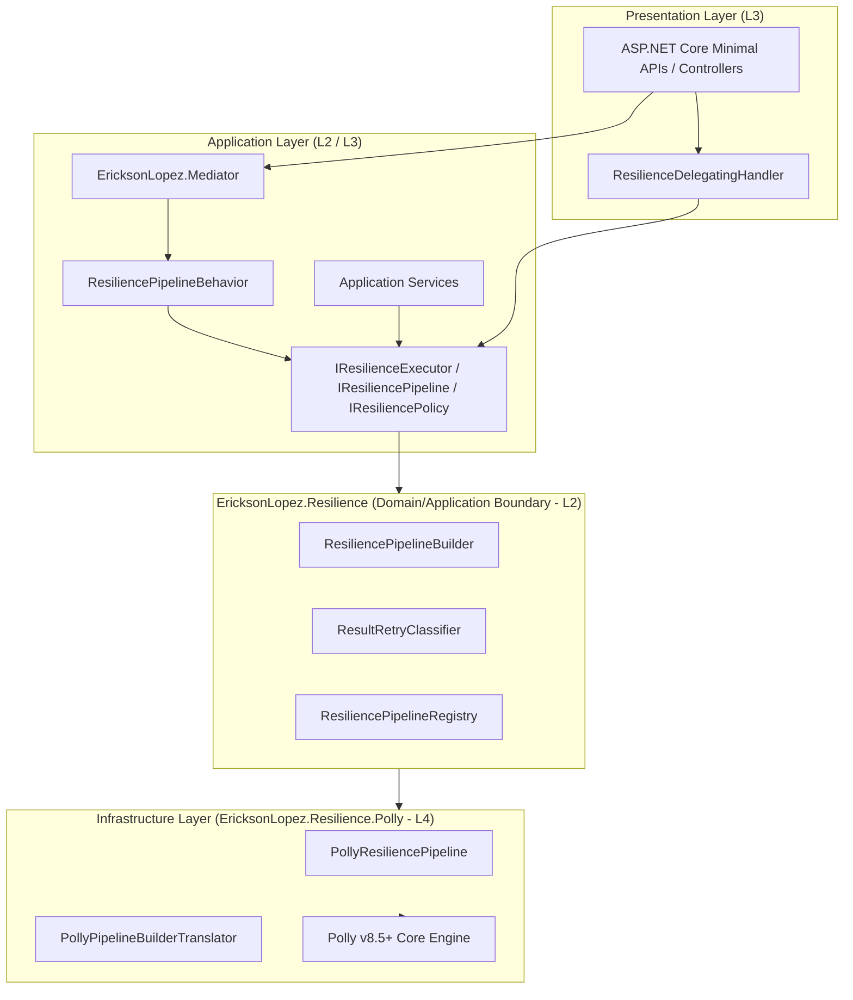
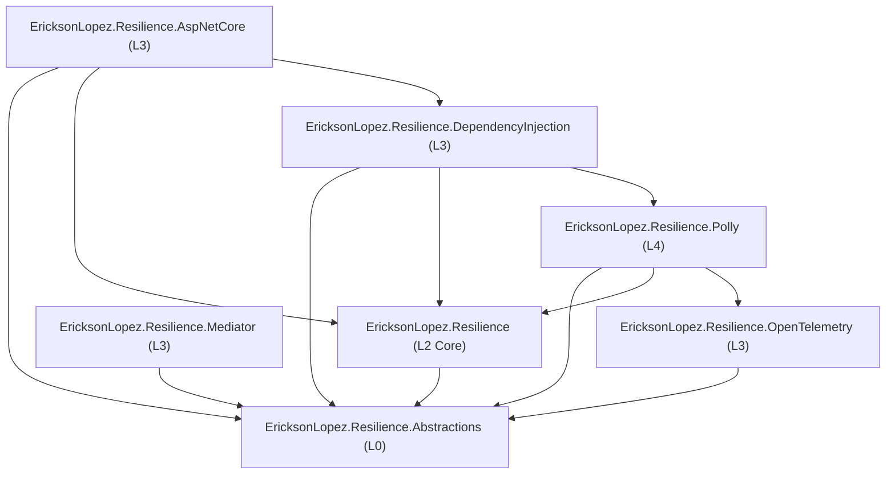
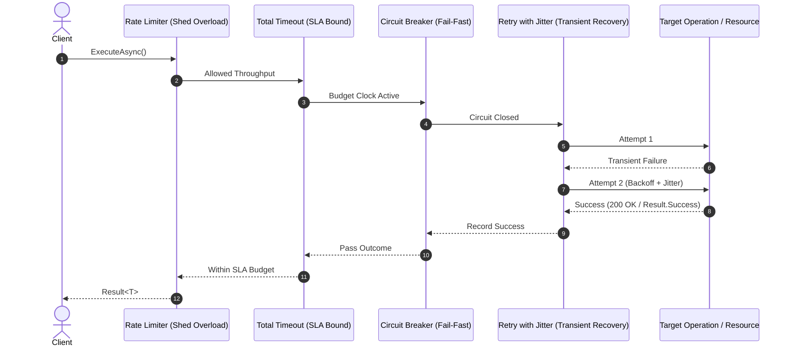

# Architecture & Design Principles

## 1. Architectural Mission

The primary objective of `EricksonLopez.Resilience` is to provide a clean, enterprise-grade resilience framework for modern .NET (.NET 8, .NET 9, .NET 10) microservices and modular monoliths.

In many legacy systems, Polly is injected directly into domain services, application handlers, and HTTP clients. This creates severe architectural coupling:
- Application handlers become dependent on third-party infrastructure abstractions (`Polly.ResiliencePipeline`, `Polly.ResilienceContext`).
- Testing requires mocking complex third-party execution delegates.
- Upgrading or replacing resilience engines requires rewriting business logic across dozens of modules.

`EricksonLopez.Resilience` completely decouples application and domain code from Polly through strict Clean Architecture layering.

---

## 2. Layer Segregation Matrix

| Package | Clean Architecture Layer | Allowed Dependencies | Prohibited Elements |
|---|---|---|---|
| `EricksonLopez.Resilience.Abstractions` | L0 Foundation | .NET BCL, `System.Threading.RateLimiting` | Polly, ASP.NET Core, EF Core, direct third-party SDKs |
| `EricksonLopez.Resilience` | L2 Application / Core | `Resilience.Abstractions`, `EricksonLopez.Result` | Polly, ASP.NET Core, Third-party SDKs |
| `EricksonLopez.Resilience.Polly` | L4 Infrastructure Adapter | `Resilience.Abstractions`, `Resilience` (Core), `Resilience.OpenTelemetry`, `Polly.Core`, `Polly.RateLimiting` | Presentation logic, Domain business rules |
| `EricksonLopez.Resilience.DependencyInjection` | L3 Integration / Composition | `Resilience.Abstractions`, `Resilience` (Core), `Resilience.Polly`, `Microsoft.Extensions.DependencyInjection.Abstractions`, `Microsoft.Extensions.Options`, `Microsoft.Extensions.Configuration.Abstractions` | Presentation UI, Direct DB persistence |
| `EricksonLopez.Resilience.Mediator` | L3 Integration | `EricksonLopez.Mediator`, `Resilience.Abstractions`, `Microsoft.Extensions.DependencyInjection.Abstractions` | Direct Polly types |
| `EricksonLopez.Resilience.OpenTelemetry` | L3 Observability | `Resilience.Abstractions`, `OpenTelemetry.Api`, `System.Diagnostics` | Direct DB persistence, UI rendering |
| `EricksonLopez.Resilience.AspNetCore` | L3 Presentation / Web | `Microsoft.AspNetCore.App`, `Resilience.Abstractions`, `Resilience` (Core), `Resilience.DependencyInjection` | Business invariant validation |

---

## 2.1 Package Dependency Graph

---

## 3. Resilience Strategy Pipeline Order

Resilience strategies must be ordered logically to avoid cascading failures and resource exhaustion:

1. **Rate Limiting (Outer)**: Reject requests immediately when concurrency or rate limits are exceeded before consuming execution threads or timeout budgets.
2. **Total Timeout**: Enforce strict upper-bound SLA execution time across all retry attempts.
3. **Circuit Breaker**: Fail fast if the downstream system is already unhealthy.
4. **Retry with Jitter (Inner)**: React to transient hiccups with decorrelated jitter backoff.
5. **Target Operation**: Protected domain or infrastructure operation.

---

## 4. Key Architectural Invariants

1. **Pure Asynchrony**: All execution APIs return `ValueTask` or `ValueTask<TResult>`. Synchronous blocking APIs (`.Execute()`) are strictly forbidden to eliminate threadpool starvation risks (ADR-006).
2. **Deterministic Context Lifecycle**: `ResilienceContext` is an immutable-friendly value carrier. Modifying properties (`WithOperationName`, `WithCorrelationId`, `WithTenantId`, `WithAttemptNumber`) returns a clean updated instance.
3. **Domain Error vs Infrastructure Error Segregation**: Business validation failures (`ErrorType.Validation`), security rejections (`Unauthorized`, `Forbidden`), and domain conflicts are never retried. Only transient infrastructure faults (`ErrorType.Unavailable`, `Infrastructure`, transient exceptions) participate in retry loops.
4. **Zero Runtime Reflection**: All pipeline registrations, strategy translations, and configuration bindings use static factories or source-generated binders to ensure 100% Native AOT and trimming safety (ADR-005, ADR-009).
