# CI/CD, Quality Gates & Build Engineering

## 1. Build Process & Central Package Management (CPM)

The repository utilizes MSBuild Central Package Management (CPM) with unified multi-project properties configured via root files:

- **`Directory.Build.props`**: Centralizes versioning (`VersionPrefix=1.0.0`), authors, package metadata, target frameworks (`net8.0;net9.0;net10.0`), compiler warning levels (`WarningLevel=5`, `TreatWarningsAsErrors=true`), SourceLink (`SymbolPackageFormat=snupkg`), Strong Name Signing (`SignAssembly=true`), and Native AOT analyzers (`EnableTrimAnalyzer=true`, `IsAotCompatible=true`).
- **`Directory.Packages.props`**: Centrally manages all NuGet package versions across production, test, and benchmark projects (`ManagePackageVersionsCentrally=true`).

---

## 2. CI/CD Pipeline Architecture

```mermaid
flowchart TD
    subgraph FastCI ["Fast CI Pipeline (ci.yml)"]
        Trigger[Push & PR: main, develop] --> Compliance[Repo Compliance: verify-compliance.ps1]
        Compliance --> BuildTest[Build, Test & Coverage: dotnet-build-test.yml]
        BuildTest --> AotSmoke[Native AOT Smoke Test: aot-smoke-test.yml]
        BuildTest --> Codecov[Codecov Coverage Upload]
    end

    subgraph QualityGates ["Quality Gates (Audits, PRs & Scheduled)"]
        PRGate[Pull Request: main, develop] --> BenchGate[Benchmark Regression Gate: benchmark-regression-gate.yml]
        PRGate --> MutateGate[Mutation Testing Gate: mutation-testing.yml]
        ScheduledGate[Weekly Schedule / Manual Dispatch] --> WeeklyMutate[Weekly Mutation Testing: mutation-testing.yml]
        ScheduledGate --> WeeklyBench[Weekly Benchmarks Baseline: weekly-benchmarks.yml]
        MutateGate --> CommitStatus[Record Commit Status: quality-gate/mutation-testing]
        WeeklyMutate --> CommitStatus
    end

    subgraph Release ["Release Pipeline"]
        PushRelease[Push to main / Release Tag] --> ReleasePlease[Release Please: release-please.yml]
        ReleasePlease --> GitHubRelease[GitHub Release Published]
        GitHubRelease --> ValidateGate[Validate Mutation Gate: scripts/validate-mutation-gate.js]
        ValidateGate -->|Score >= 95%| PublishNuGet[Publish to NuGet: publish.yml]
        ValidateGate -.->|Score < 95%| BlockRelease[❌ Release Blocked]
    end
```



---

## 3. GitHub Actions Workflows Catalog

The repository includes 10 dedicated GitHub Actions workflow definitions:

| Workflow File | Name | Trigger | Key Jobs & Actions | Secrets Required |
|---|---|---|---|---|
| [`.github/workflows/ci.yml`](../.github/workflows/ci.yml) | Continuous Integration | `push`, `pull_request` on `main`, `develop` | Orchestrates fast repo compliance, build/test matrix with SonarCloud, and Native AOT smoke test. | `SNK_KEY`, `CODECOV_TOKEN`, `SONAR_TOKEN` |
| [`.github/workflows/dotnet-build-test.yml`](../.github/workflows/dotnet-build-test.yml) | Build and Test | `workflow_call`, `workflow_dispatch` | Sets up .NET 8, 9, 10 & Java 17; restores SNK key; performs SonarCloud static analysis; builds Release; runs tests with XPlat coverage; uploads to Codecov. | `SNK_KEY`, `CODECOV_TOKEN`, `SONAR_TOKEN` |
| [`.github/workflows/aot-smoke-test.yml`](../.github/workflows/aot-smoke-test.yml) | Native AOT Smoke Test | `workflow_call`, `workflow_dispatch` | Publishes self-contained Linux-x64 AOT binary and executes smoke test assertions. | `SNK_KEY` |
| [`.github/workflows/benchmark-regression-gate.yml`](../.github/workflows/benchmark-regression-gate.yml) | Benchmark Regression Gate | `pull_request` affecting `src/**`, `benchmarks/**`, `workflow_dispatch` | Runs BenchmarkDotNet on PR head, compares vs baseline JSON, and fails if regression exceeds threshold (default 10%). | `SNK_KEY` |
| [`.github/workflows/benchmarks.yml`](../.github/workflows/benchmarks.yml) | Benchmarks | `workflow_call`, `workflow_dispatch` | Runs BenchmarkDotNet with configurable filter, publishes step summaries and markdown artifacts. | `SNK_KEY` |
| [`.github/workflows/mutation-testing.yml`](../.github/workflows/mutation-testing.yml) | Mutation Testing Quality Gate | `pull_request` on `main`, `develop`, weekly cron (`0 3 * * 0`), `workflow_dispatch` (`Basic`, `Standard`, `Advanced`), `workflow_call` | Executes matrix Stryker mutation testing across packages as a Quality Gate (not on every push); posts commit status `quality-gate/mutation-testing`. | `SNK_KEY` |
| [`.github/workflows/publish.yml`](../.github/workflows/publish.yml) | Publish Packages | `release` (`published`), `workflow_dispatch` | Validates target commit mutation score (≥95%) before packing Release packages and pushing to NuGet. | `SNK_KEY`, `NUGET_API_KEY` |
| [`.github/workflows/release-please.yml`](../.github/workflows/release-please.yml) | Release Please | `push` on `main` | Automates semantic versioning, changelog generation, and GitHub release creation. | Standard `GITHUB_TOKEN` |
| [`.github/workflows/repo-compliance.yml`](../.github/workflows/repo-compliance.yml) | Repository Compliance | `workflow_call`, `pull_request` on `main`, `develop`, `workflow_dispatch` | Executes `scripts/verify-compliance.ps1` to enforce architectural governance and standards. | None |
| [`.github/workflows/weekly-benchmarks.yml`](../.github/workflows/weekly-benchmarks.yml) | Weekly Benchmarks | Weekly cron (`0 2 * * 0`), `workflow_dispatch` | Runs multi-TFM cross-runtime benchmarks and automatically commits updated baseline results to `benchmarks/results/`. | `SNK_KEY` |

---

## 4. Quality Gates & Enforcement

### 1. Zero Warnings Policy
All production and test code is compiled with `<TreatWarningsAsErrors>true</TreatWarningsAsErrors>` and `<WarningLevel>5</WarningLevel>`. Any compiler warning is treated as a fatal build failure.

### 2. Code Coverage Gate
Automated unit and integration tests run with Coverlet data collection (`--collect:"XPlat Code Coverage"`). Coverage reports in Cobertura format are uploaded to Codecov with strict branch, line, and method thresholds (target: 100%).

### 3. Mutation Testing Quality Gate (Stryker.NET)
Stryker is configured across 8 dedicated configuration files:
- `stryker-config.json` — **Global fallback** (same target as `stryker-core-config.json`; used when no package-specific config is found)
- `stryker-core-config.json` — `EricksonLopez.Resilience` (Core)
- `stryker-abstractions-config.json` — `EricksonLopez.Resilience.Abstractions`
- `stryker-polly-config.json` — `EricksonLopez.Resilience.Polly`
- `stryker-dependencyinjection-config.json` — `EricksonLopez.Resilience.DependencyInjection`
- `stryker-mediator-config.json` — `EricksonLopez.Resilience.Mediator`
- `stryker-opentelemetry-config.json` — `EricksonLopez.Resilience.OpenTelemetry`
- `stryker-aspnetcore-config.json` — `EricksonLopez.Resilience.AspNetCore`

#### Architectural Principles & Gate Operation:
1. **Quality Gate vs Fast Push**: Fast feedback on every `push` is reserved for standard CI (compliance, build, unit test coverage, and Native AOT smoke tests). Mutation testing is an explicit Quality Gate executed on Pull Requests, scheduled weekly runs, manual dispatches, or release verification — **never triggered on every push**.
2. **Quality Gate Status & Release Validation**: When executed, Stryker matrix results are saved as artifacts, rendered in Step Summaries, and published as GitHub Commit Statuses (`quality-gate/mutation-testing` and `quality-gate/mutation-testing/<package>`).
3. **Execution Profiles (`workflow_dispatch`)**:
   - `Basic`: Core packages (`core`, `abstractions`)
   - `Standard`: Core + primary adapters (`core`, `abstractions`, `polly`, `mediator`)
   - `Advanced`: Full suite across all 7 packages.
4. **Single Source of Truth Thresholds**:
   - `break = 95`: Hard failure threshold. Exit code `1` if `< 95%`.
   - `low = 98`: Warning threshold (`95% - 97.99%` is `🟠 WARNING`, `98% - 99.99%` is `🟡 LOW`).
   - `high = 100`: `✅ HIGH`.
5. **Release Gate Validation (`publish.yml`)**:
   - Before publishing to NuGet, the release pipeline queries the commit status of the commit SHA being released using [`scripts/validate-mutation-gate.js`](../scripts/validate-mutation-gate.js).
   - If `mutation score >= 95%` -> Release is permitted.
   - If `mutation score < 95%` or unanalyzed -> Release is blocked.
   - The release does **not** re-run Stryker unnecessarily.

> **Note**: `stryker-config.json` and `stryker-core-config.json` are intentionally identical; the global file serves as a CI fallback when the matrix references a package key without a dedicated config file.

### 4. Architecture Governance Auditor
The PowerShell script [`scripts/verify-compliance.ps1`](../scripts/verify-compliance.ps1) verifies 7 critical invariants:
1. **Kebab-Case Naming**: All files in `docs/` must use lowercase kebab-case (`*.md`).
2. **Zero `[Obsolete]` APIs**: Zero obsolete attribute decorations in production code (`src/`).
3. **Canonical MIT Copyright**: Every C# file must start with `// Copyright © Erickson Lopez. MIT License.`.
4. **One Type Per File**: Exactly one top-level type declared per file in `src/`.
5. **GitHub Identity Consistency**: Project URLs must target `ericksonlopezf/dotnet-resilience`.
6. **Support & Security Email Normalization**: Official contact email must be `ericksonlopezf@gmail.com`.
7. **Prohibited Suppressions**: Zero illegal `<NoWarn>` suppressions in `.csproj` files.

### 5. Architectural Unit Testing (`NetArchTest.Rules`)
Enforced in `EricksonLopez.Resilience.ArchitectureTests`:
- `Abstractions` (L0) has zero dependencies on Polly, ASP.NET Core, or infrastructure.
- `Resilience` (L2 Core) has zero dependencies on Polly.
- Only `EricksonLopez.Resilience.Polly` (L4) references `Polly.Core`.
- All Mediator behaviors implement `IPipelineBehavior<,>` without runtime reflection.

---

## 5. Security & Supply Chain Integrity

### 1. Strong Name Signing
All production binaries are strongly named using an RSA key (`EricksonLopez.snk`). In CI environments, the key is restored from the `SNK_KEY` GitHub Secret into the repository root before compilation.

### 2. NuGet Trusted Publishing
Packages are packed with embedded SourceLink metadata, symbol packages (`.snupkg`), and published via authenticated CI actions using `NUGET_API_KEY`.

---

## 6. Developer Quality Commands

```bash
# 1. Clean build across all TFMs (.NET 8, 9, 10)
dotnet build EricksonLopez.Resilience.slnx --configuration Release

# 2. Execute test suite with coverage
dotnet test EricksonLopez.Resilience.slnx --configuration Release

# 3. Publish and run Native AOT Smoke Test
dotnet publish tests/EricksonLopez.Resilience.AotSmokeTest/EricksonLopez.Resilience.AotSmokeTest.csproj -c Release -r linux-x64 --self-contained -o ./aot-output
./aot-output/EricksonLopez.Resilience.AotSmokeTest

# 4. Verify architectural compliance
pwsh -File scripts/verify-compliance.ps1

# 5. Run performance benchmarks
dotnet run -c Release --project benchmarks/EricksonLopez.Resilience.Benchmarks/EricksonLopez.Resilience.Benchmarks.csproj
```

---

## 7. Branch Strategy

The following branch model is derived from the CI trigger configuration in `.github/workflows/ci.yml`:

| Branch | Purpose | CI Trigger |
|---|---|---|
| `main` | Production-ready, release-tagged code | CI (push), repo-compliance, release-please |
| `develop` | Active development integration | CI (push + PR) |
| `feature/*` | Feature development branches | PR to `develop` or `main` |
| `fix/*` | Bug-fix branches | PR to `develop` or `main` |

Release creation is automated via **release-please** (`release-please.yml`) on pushes to `main`. A GitHub Release event triggers `publish.yml` which packages and pushes all 7 NuGet packages.
