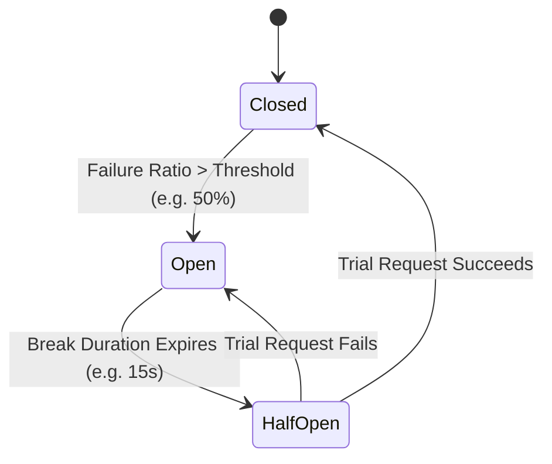

# Circuit Breaker Strategy

## Overview

The circuit breaker strategy prevents an application from repeatedly attempting an operation that is almost certain to fail, protecting downstream systems from catastrophic collapse and allowing them time to recover.



---

## Circuit Breaker States

| State | Description | Execution Behavior |
|---|---|---|
| `Closed` | Normal healthy operation. | All executions proceed directly to target. |
| `Open` | Failure threshold exceeded; downstream is unhealthy. | Executions fail immediately with `CircuitBrokenException`. |
| `HalfOpen` | Trial period after break duration expires. | A limited number of trial executions test downstream health. |
| `Isolated` | Circuit administratively forced open. | All executions blocked until manually reset. |

---

## Configuration

```csharp
using System;
using System.Threading.Tasks;
using EricksonLopez.Resilience.Options;

builder.AddCircuitBreaker(options =>
{
    // Failure percentage (0.0 to 1.0) triggering open circuit (e.g. 50%)
    options.FailureRatio = 0.5;

    // Minimum executions required in sampling window before evaluating ratio
    options.MinimumThroughput = 20;

    // Time window for measuring failure ratio
    options.SamplingDuration = TimeSpan.FromSeconds(30);

    // How long circuit stays open before testing half-open recovery
    options.BreakDuration = TimeSpan.FromSeconds(15);

    // Lifecycle hooks
    options.OnCircuitOpened = ctx =>
    {
        Console.WriteLine($"Circuit opened for policy {ctx.ResilienceContext?.PolicyName}. Break duration: {ctx.BreakDuration}");
        return ValueTask.CompletedTask;
    };
    options.OnCircuitClosed = ctx =>
    {
        Console.WriteLine($"Circuit closed for policy {ctx.ResilienceContext?.PolicyName}.");
        return ValueTask.CompletedTask;
    };
    options.OnCircuitHalfOpened = ctx =>
    {
        Console.WriteLine($"Circuit half-opened for policy {ctx.ResilienceContext?.PolicyName}.");
        return ValueTask.CompletedTask;
    };
});
```
