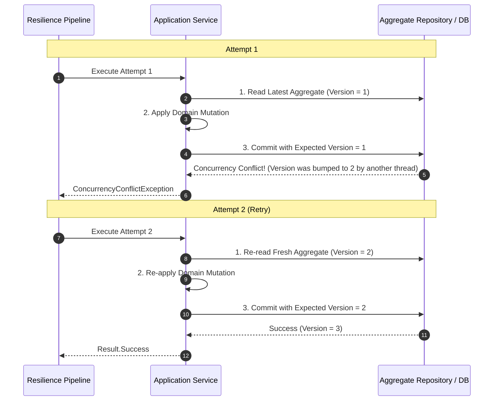

# Optimistic Concurrency & Resilience

## Overview

In high-concurrency Domain-Driven Design architectures, entities maintain a `Version` or `RowVersion` to detect concurrent writes.

When two threads update the same aggregate simultaneously, one commits while the other fails with a `ConcurrencyConflictException`.

## The Invariant: Re-read Before Retry

> **Retrying a concurrency conflict without reloading fresh aggregate state is a fatal bug.**

If an application blindly re-attempts the database `UPDATE` with stale in-memory data, it will either fail indefinitely or overwrite changes made by the competing transaction.

---

## The Correct Concurrency Retry Pattern



---

## Code Example

```csharp
using System.Threading;
using System.Threading.Tasks;
using EricksonLopez.Resilience;
using EricksonLopez.Result;

public sealed class AccountService(IResilienceExecutor executor, IAccountRepository accountRepository)
{
    public async ValueTask<Result<bool>> DebitAccountAsync(Guid accountId, decimal amount, CancellationToken ct)
    {
        return await executor.ExecuteAsync(
            "account-debit-policy",
            async ctx =>
            {
                // 1. MUST re-read the fresh aggregate version inside the retry delegate
                var account = await accountRepository.GetByIdAsync(accountId, ctx.CancellationToken);
                if (account is null)
                {
                    return Result<bool>.Failure(Error.NotFound("Account.NotFound", "Account does not exist."));
                }

                // 2. Re-apply business logic on the new state
                var domainResult = account.Debit(amount);
                if (domainResult.IsFailure)
                {
                    return domainResult; // Business validation failure; do not retry
                }

                // 3. Commit to database with version check
                return await accountRepository.UpdateAsync(account, ctx.CancellationToken);
            },
            ct);
    }
}
```
