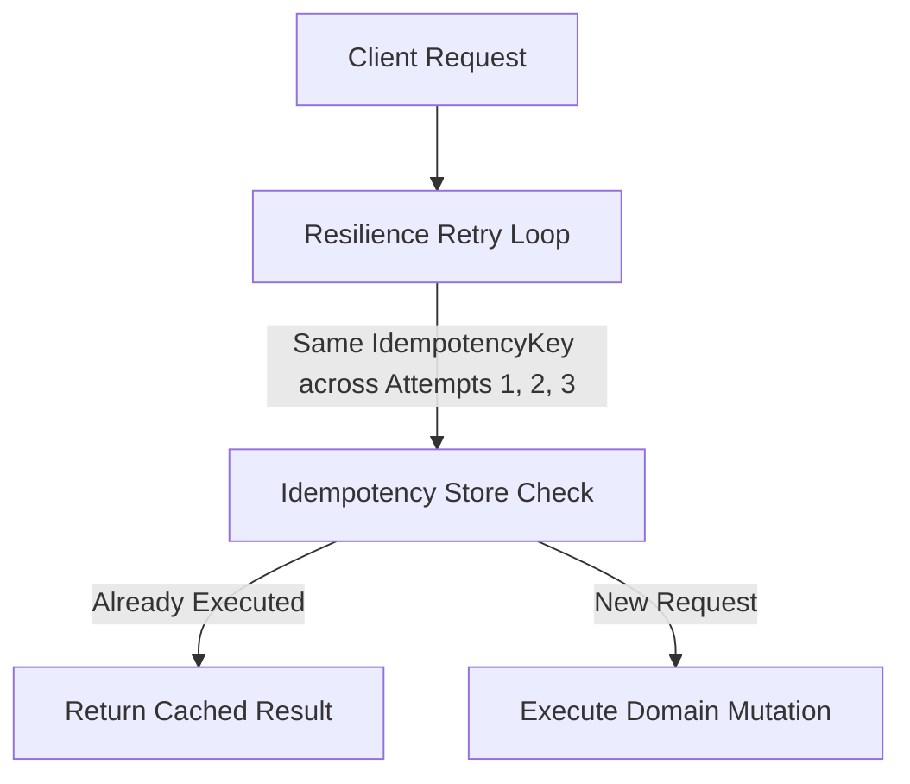

# Idempotency & Resilience Integration

## Overview

When retrying state-mutating requests (such as payments, orders, or transfers), there is a critical danger of duplicate execution if a transient failure occurs after the server processed the mutation but before the response reached the client.

To prevent double-charging or duplicate entity creation, **Resilience must preserve the original Idempotency Key across all retry attempts**.

---

## Architectural Rule

> **Resilience is the Outer Scope; Idempotency is the Inner Scope.**



1. **Attempt 1**: Generates or receives `IdempotencyKey: "ORD-998811"`. The network drops right as the database commits.
2. **Attempt 2 (Retry)**: Reuses `IdempotencyKey: "ORD-998811"`.
3. **Idempotency Store**: Detects the key was already committed and returns the exact same cached `Result<T>` safely without duplicating the transaction.

---

## Example Pattern

```csharp
using System.Threading;
using System.Threading.Tasks;
using EricksonLopez.Idempotency;
using EricksonLopez.Resilience;
using EricksonLopez.Result;

public sealed class ResilientOrderProcessor
{
    private readonly IResilienceExecutor _executor;
    private readonly IIdempotencyService _idempotencyService;

    public ResilientOrderProcessor(IResilienceExecutor executor, IIdempotencyService idempotencyService)
    {
        _executor = executor;
        _idempotencyService = idempotencyService;
    }

    public async ValueTask<Result<OrderResponse>> ProcessOrderAsync(
        CreateOrderRequest request,
        string idempotencyKey,
        CancellationToken cancellationToken)
    {
        // Execute inside resilience pipeline — the idempotency key remains constant across all retry attempts
        return await _executor.ExecuteAsync(
            "order-creation-policy",
            async ctx =>
            {
                return await _idempotencyService.ExecuteIdempotentAsync(
                    idempotencyKey,
                    async ct => await SubmitOrderToDatabaseAsync(request, ct),
                    ctx.CancellationToken);
            },
            cancellationToken);
    }
}
```
