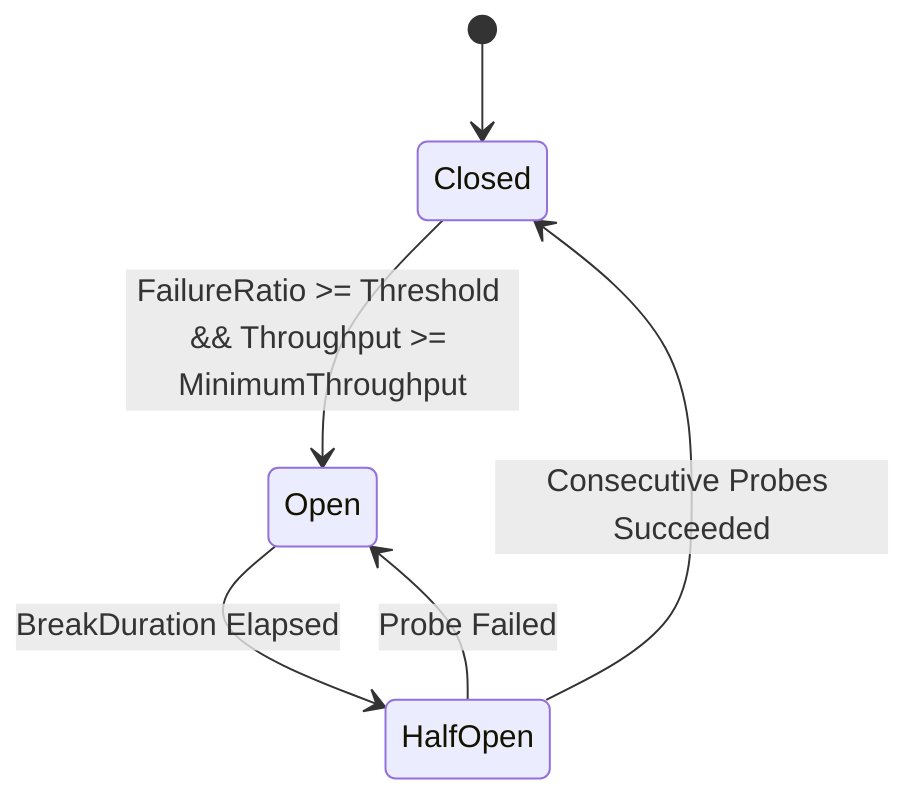

# Master Feature & Resilience Strategies Matrix

This document provides a comprehensive technical reference detailing resilience strategies, mathematical backoff models, circuit breaker state machine transitions, and telemetry metrics across the `EricksonLopez.Resilience` ecosystem.

---

## 1. Resilience Strategy Capabilities Matrix

| Strategy | Options Model | Key Parameters | Fail-Open / Fail-Closed | Zero-Allocation Path | Native AOT Compatible |
| :--- | :--- | :--- | :--- | :---: | :---: |
| **Retry** | `RetryStrategyOptions` | `MaxRetryAttempts`, `Delay`, `BackoffType`, `MaxDelay`, `ShouldHandleException`, `ShouldHandleResult` | Fail-Closed (throws after max attempts) | Yes (Success path) | Yes |
| **Circuit Breaker** | `CircuitBreakerStrategyOptions` | `FailureRatio`, `MinimumThroughput`, `SamplingDuration`, `BreakDuration`, `State` | Fail-Closed (`CircuitBrokenException`) | Yes (Closed state) | Yes |
| **Rate Limiter** | `RateLimiterStrategyOptions` | `PermitLimit`, `QueueLimit`, `Window`, `LimiterType` (Sliding / Fixed / Concurrency / TokenBucket) | Fail-Closed (`RateLimitRejectedException`) | Yes (Available permit) | Yes |
| **Timeout** | `TimeoutStrategyOptions` | `Timeout`, `OnTimeout` | Fail-Closed (`ResilienceTimeoutException`) | Yes (Prompt completion) | Yes |
| **Hedging** | `HedgingStrategyOptions` | `MaxHedgedAttempts`, `Delay`, `ShouldHandleException` | Fail-Open (first successful candidate) | Yes | Yes |
| **Fallback** | `FallbackStrategyOptions` | `FallbackAction`, `ShouldHandle` | Fail-Open (returns substitute value) | Yes | Yes |

---

## 2. Mathematical Backoff & Jitter Models

| Backoff Type (`BackoffType`) | Calculation Formula | Variance / Jitter | Use Case |
| :--- | :--- | :--- | :--- |
| **`Constant`** | $T(n) = \text{Delay}$ | None | Periodic polling with deterministic intervals |
| **`Linear`** | $T(n) = \text{Delay} \times n$ | None | Mild transient network recovery |
| **`Exponential`** | $T(n) = \text{Delay} \times 2^{n-1}$ | None | Cascading overload mitigation |
| **`ExponentialWithJitter`** | $T(n) = \text{Uniform}(0, \text{Delay} \times 2^{n-1})$ | Decorrelated Full Jitter | High-scale microservices, preventing thundering herd spikes |

---

## 3. Circuit Breaker State Transition Matrix

| Source State | Trigger Condition | Target State | In-Flight Requests |
| :--- | :--- | :--- | :--- |
| **`Closed`** | Failure threshold exceeded within `SamplingDuration` | **`Open`** | Normal execution allowed |
| **`Open`** | `BreakDuration` window expires | **`HalfOpen`** | Fast-fail rejection with `CircuitBrokenException` |
| **`HalfOpen`** | Configured trial probe executions succeed | **`Closed`** | Limited probe permits admitted |
| **`HalfOpen`** | Single trial probe execution fails | **`Open`** | Reset `BreakDuration` timer |

---

## 4. Framework & Observability Integrations

| Integration | Package | Key Mechanism | Telemetry & Observability |
| :--- | :--- | :--- | :--- |
| **ASP.NET Core** | `EricksonLopez.Resilience.AspNetCore` | `ResilienceDelegatingHandler`, `[Resilient]` metadata | HTTP client outbound pipeline interception |
| **EricksonLopez.Mediator** | `EricksonLopez.Resilience.Mediator` | `ResiliencePipelineBehavior<TRequest, TResponse>` | CQRS command & query pipeline wrapping via `IResilientRequest` |
| **OpenTelemetry** | `EricksonLopez.Resilience.OpenTelemetry` | `ResilienceMeter`, `ResilienceActivitySource` | Metrics: `resilience.executions`, `resilience.retries`, `resilience.circuit_breaker.state` |
| **Polly Engine** | `EricksonLopez.Resilience.Polly` | `PollyPipelineBuilderTranslator`, `PollyResiliencePipeline` | Zero-overhead compilation to Polly v8 unified core |
