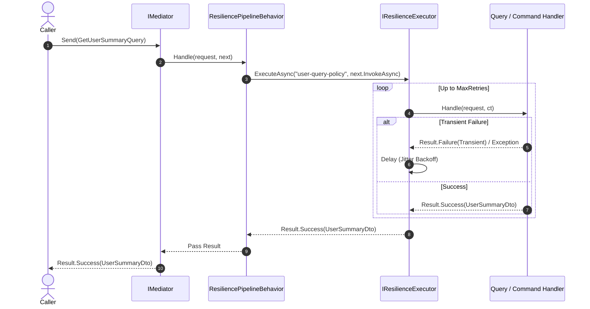

# Mediator Pipeline Integration

## Overview

`EricksonLopez.Resilience.Mediator` integrates resilience policies into the `EricksonLopez.Mediator` request pipeline.

It uses zero-allocation struct continuations (`IPipelineBehavior<TRequest, TResponse> where TNext : struct, INext<TResponse>`), avoiding intermediate object allocations in high-throughput command and query processing.

---

## Marking Requests for Resilience

Implement `IResilientRequest` on your command or query:

```csharp
using System;
using EricksonLopez.Mediator;
using EricksonLopez.Resilience.Mediator.Contracts;
using EricksonLopez.Result;

public sealed record GetUserSummaryQuery(Guid UserId) : IQuery<Result<UserSummaryDto>>, IResilientRequest
{
    // The named resilience policy configured in DI
    public string ResiliencePolicy => "user-query-policy";
}
```

---

## Registration

Register the resilience pipeline behavior in your ServiceCollection:

```csharp
using EricksonLopez.Resilience.DependencyInjection;
using EricksonLopez.Resilience.Mediator.Extensions;
using Microsoft.Extensions.DependencyInjection;

var services = new ServiceCollection();

// 1. Register Resilience and named policies
services.AddEricksonLopezResilience(options =>
{
    options.AddPolicy("user-query-policy", builder =>
    {
        builder.AddStandardResilience();
    });
});

// 2. Register Resilience Pipeline Behavior for Mediator
services.AddResiliencePipelineBehavior();
```

---

## Pipeline Execution Flow


