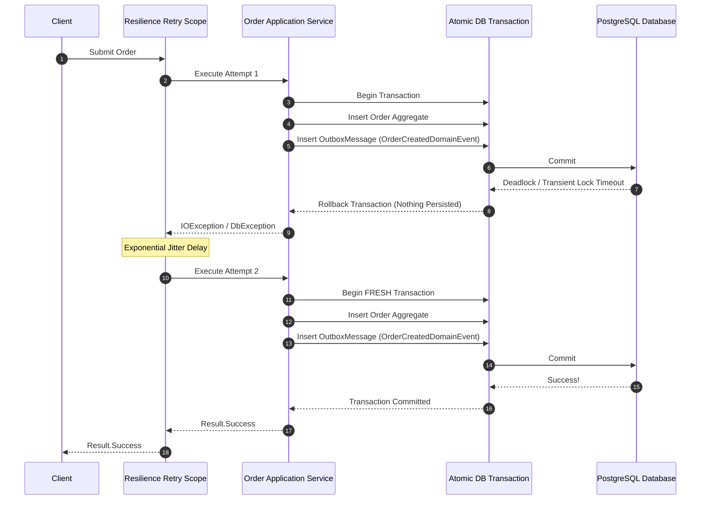

# Outbox Pattern & Resilience

## Overview

The Transactional Outbox pattern guarantees eventual consistency and at-least-once messaging by persisting domain events into an `OutboxMessages` table in the same database transaction as the aggregate state changes.

When retrying operations with resilience:
> **The Outbox message persistence must be part of the atomic transaction executed within each retry attempt.**

---

## Architecture Flow

---

## Atomicity Guarantee

Because both the domain state and the outbox message rollback together on failure:
- **No Orphan Messages**: Outbox messages are never published if the order creation fails.
- **No Duplicate Outbox Messages**: If attempt 1 fails before commit, attempt 2 creates exactly 1 order and 1 outbox message.
