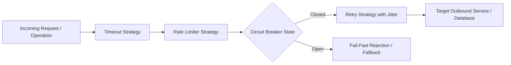

# Level 00: Architectural Introduction & Mental Model

## 1. Overview & Problem Statement
In cloud microservices and distributed event architectures, transient network failures, service degradation, and latency spikes require robust fault-tolerance strategies:
- **Cascading Failures**: Unhandled downstream timeouts overwhelming client threads and crashing upstream services.
- **Polly v7/v8 Legacy Overhead**: Heavy closure allocations and reflection-based policy registries causing Gen 0 GC pauses.
- **Observability Deficits**: Lack of standardized OpenTelemetry metrics for retry counts, circuit breaker state transitions, and rate limiting rejections.

`EricksonLopez.Resilience` provides an **Ultra-Fast, Zero-Allocation Fault Tolerance & Resilience Engine**:
- **Polly v8 Modern Core**: Direct integration with high-performance `ResiliencePipeline` and zero-allocation strategies.
- **Multi-Strategy Compositions**: Seamlessly combine Retry, Circuit Breaker, Timeout, Rate Limiting, and Hedging.
- **100% Native AOT & Trimming Compliant**: Zero reflection, pure struct-based context propagation, and compile-time verification.

---

## 2. Resilience Execution Pipeline Flow

---

## 3. High-Level Comparison

| Capability | Legacy Polly v7 | Microsoft.Extensions.Resilience | EricksonLopez.Resilience |
|---|---|---|---|
| **Pipeline Performance** | Heap-allocating delegates | Generic builder | **Zero-Allocation Struct Pipelines** |
| **Native AOT Compatible** | ❌ Trimming warnings | ⚠️ Partial | ✅ **100% Guaranteed Native AOT** |
| **OpenTelemetry Native** | ❌ Custom events | ⚠️ Basic metrics | ✅ **Full W3C Semantic Metrics & Tracing** |
| **Mediator & ASP.NET Core** | ❌ Manual integration | ⚠️ Basic HTTP | ✅ **First-Class Pipeline Behaviors & Filters** |
