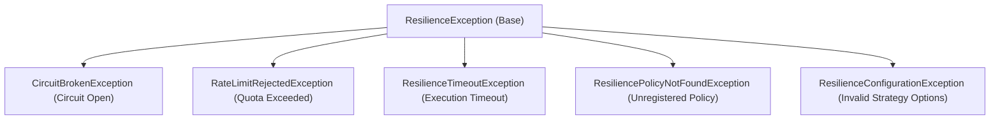

# Level 06: Error Handling — Deterministic Classifiers & Exception Hierarchy

## 1. ResultRetryClassifier & Error Invariants
`ResultRetryClassifier` is the central deterministic classifier evaluated by retry and circuit breaker strategies:

```csharp
using System;
using System.IO;
using System.Net.Http;
using System.Net.Sockets;
using EricksonLopez.Resilience.Classification;
using EricksonLopez.Result;

var classifier = ResultRetryClassifier.Instance;

// Runtime Exceptions:
classifier.ClassifyException(new SocketException(10054)); // -> RetryabilityDecision.Retry
classifier.ClassifyException(new TimeoutException());       // -> RetryabilityDecision.Retry
classifier.ClassifyException(new OperationCanceledException()); // -> RetryabilityDecision.DoNotRetry
classifier.ClassifyException(new ArgumentException());      // -> RetryabilityDecision.DoNotRetry

// Domain Error Objects:
classifier.ClassifyError(Error.Infrastructure("Db.Fail", "Timeout")); // -> RetryabilityDecision.Retry
classifier.ClassifyError(Error.Unavailable("Svc.Busy", "Busy"));     // -> RetryabilityDecision.Retry
classifier.ClassifyError(Error.Validation("Card.Invalid", "Invalid"));// -> RetryabilityDecision.DoNotRetry
classifier.ClassifyError(Error.Domain("User.Inactive", "Inactive"));  // -> RetryabilityDecision.DoNotRetry
```

---

## 2. Framework Exception Hierarchy
All resilience exceptions derive cleanly from `ResilienceException`:



### Interception Example
```csharp
try
{
    await executor.ExecuteAsync("billing-policy", async ct => await CallRemoteServiceAsync(ct));
}
catch (CircuitBrokenException ex)
{
    logger.LogWarning("Circuit {Policy} is open. Retry after {RetryAfter}s", ex.PolicyName, ex.RetryAfter?.TotalSeconds);
}
catch (RateLimitRejectedException ex)
{
    logger.LogWarning("Rate limit exceeded for policy {Policy}", ex.PolicyName);
}
catch (ResilienceTimeoutException ex)
{
    logger.LogWarning("Operation timed out after {Timeout}ms", ex.Timeout.TotalMilliseconds);
}
catch (ResiliencePolicyNotFoundException ex)
{
    logger.LogError("Policy {Policy} was not configured during DI startup", ex.PolicyName);
}
```
