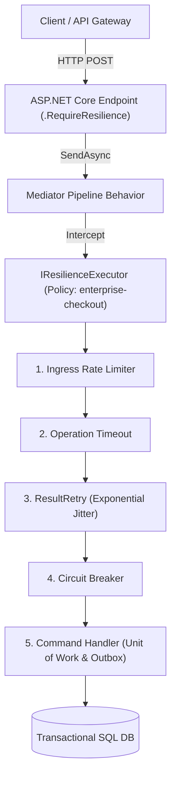

# Level 10: Enterprise Architecture — Mission-Critical Reference Solution

## 1. End-to-End Clean Architecture Overview
In an enterprise cloud microservice, resilience connects across all architectural boundaries:

---

## 2. Ingress to Persistence Flow
1. **Presentation Layer**: The HTTP request arrives with an `Idempotency-Key` and `Tenant-Id` header.
2. **Mediator Pipeline**: `ResiliencePipelineBehavior` wraps command execution with `IResilienceExecutor`.
3. **Resilience Strategies**:
   - **Rate Limiting**: Throttles quota per tenant.
   - **Timeout**: Enforces an SLA deadline.
   - **Retry & Circuit Breaker**: Evaluates returned `Result<T>` and handles transient database lock timeouts.
4. **Application Handler**:
   - Initializes a fresh database transaction for each retry attempt.
   - Preserves and checks the idempotency key.
   - Commits aggregate changes and writes event to Transactional Outbox atomically.
5. **Observability**: Metrics (`ResilienceMeter`) and Tracing (`ResilienceActivitySource`) capture duration, retry counts, and tenant metadata.
