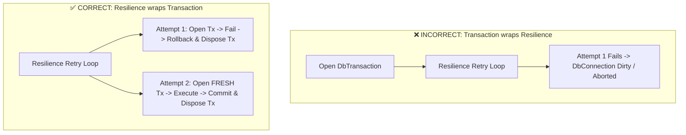

# Transaction Boundaries & Resilience

## Overview

A critical architectural invariant when integrating resilience with transactional systems is the boundary hierarchy:

> **Resilience must enclose the Transaction boundary (`Resilience -> Transaction`).**

Never place the resilience retry loop inside an open database transaction.



---

## Why Inner Transactions are Mandatory

1. **Deadlock / Poisoned State**: Once a PostgreSQL / SQL Server transaction experiences a conflict or socket error, the transaction state becomes `ABORTED`. Attempting queries on an aborted transaction throws `25P02: current transaction is aborted, commands ignored until end of transaction block`.
2. **Resource Leaks**: Holding database locks open while sleeping in a retry backoff delay starves other connections.
3. **Clean Isolation**: Every retry attempt must instantiate and commit/rollback a completely new `IUnitOfWork` or `IDbTransaction`.

---

## Correct Implementation Pattern

```csharp
public async ValueTask<Result<Guid>> CreateInvoiceAsync(CreateInvoiceCommand cmd, CancellationToken ct)
{
    // Resilience wraps the entire transaction scope
    return await _resilienceExecutor.ExecuteAsync(
        "transaction-policy",
        async ctx =>
        {
            // Fresh UnitOfWork instantiated per attempt
            await using var uow = await _unitOfWorkFactory.CreateAsync(ctx.CancellationToken);
            
            var invoice = Invoice.Create(cmd.CustomerId, cmd.Amount);
            await uow.Invoices.AddAsync(invoice, ctx.CancellationToken);
            
            await uow.CommitAsync(ctx.CancellationToken);
            return Result<Guid>.Success(invoice.Id);
        },
        ct);
}
```
